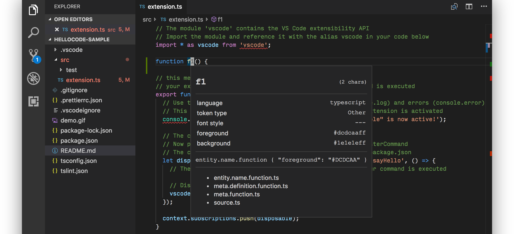
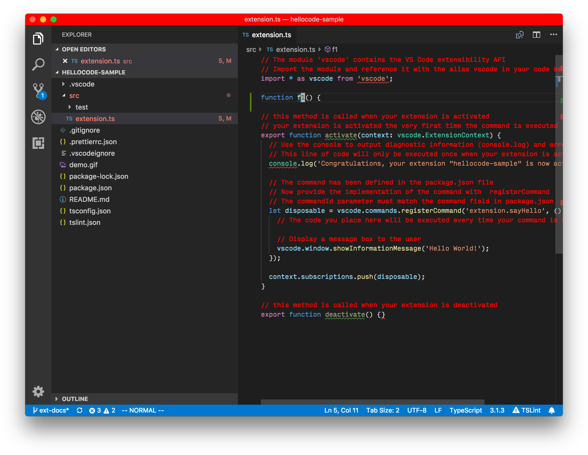

---
---

# Color Theme

---
**Writing Instructions**

This is one of the options mentioned in https://vscode-ext-docs.azurewebsites.net/api/extension-capabilities/theming.

- Migrate content from https://code.visualstudio.com/docs/extensions/themes-snippets-colorizers#_adding-a-new-color-theme
- Update https://github.com/Microsoft/vscode-extension-samples/tree/master/theme-sample so it includes a README and link back to this guide

---

**Suggested Sections**

## UI Colors

- In this section, explain `colors`, link to https://vscode-ext-docs.azurewebsites.net/api/references/theme-color, explain the setting `workbench.colorCustomizations`
- Give a recommended workflow, such as:
  - Start adjusting colors by tweaking `workbench.colorCustomizations`
  - Then copy the keys to `colors` in a theme extension

## Syntax Colors

- In this section, explain `tokenColors`, link to the [Syntax Highlight Guide](https://vscode-ext-docs.azurewebsites.net/api/language-extensions/syntax-highlight-guide), explain scope inspector, explain `editor.tokenColorCustomization` setting
- Give a recommended workflow, such as:
  - Start adjusting colors by tweaking `workbench.tokenColorCustomizations`
  - Then copy the keys to `tokenColors` in a theme extension

---

**Some content for reusing**

A good guide: https://css-tricks.com/creating-a-vs-code-theme/

As you can see in the illustration, Color Theme defines two mappings, `colors` for UI Component colors and `tokenColors` for Text Token colors.

[Theme Color Reference](/api/references/theme-color) is a good starting point for customizing UI Component colors.

If you want to change the color of text in your editor, you need to know how the text is tokenized. VS Code provides a handy command `Developer: Inspect TM Scopes` that shows you the TextMate scopes of each syntax token in the editor.



There are also two settings, `workbench.colorCustomizations` and `editor.tokenColorCustomizations` that correspond to the `color` and `tokenColors` color theme config. They provide a quick way for you to play with colors. For example, try adding this to your user settings:

```json
{
  "workbench.colorCustomizations": {
    "titleBar.activeBackground": "#ff0000"
  },
  "editor.tokenColorCustomizations": {
    "comments": "#FF0000"
  }
}
```


