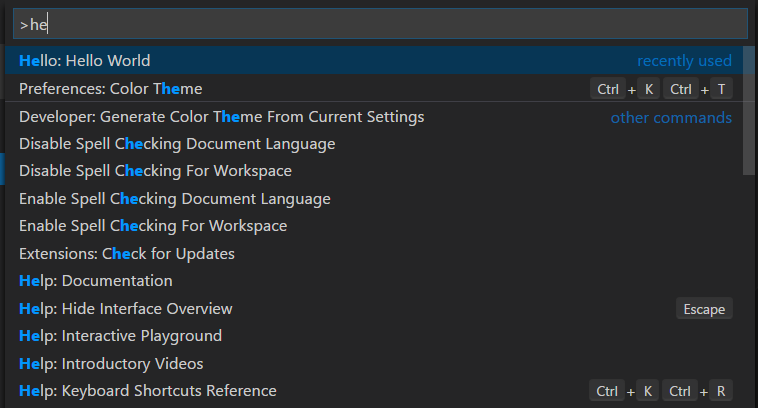
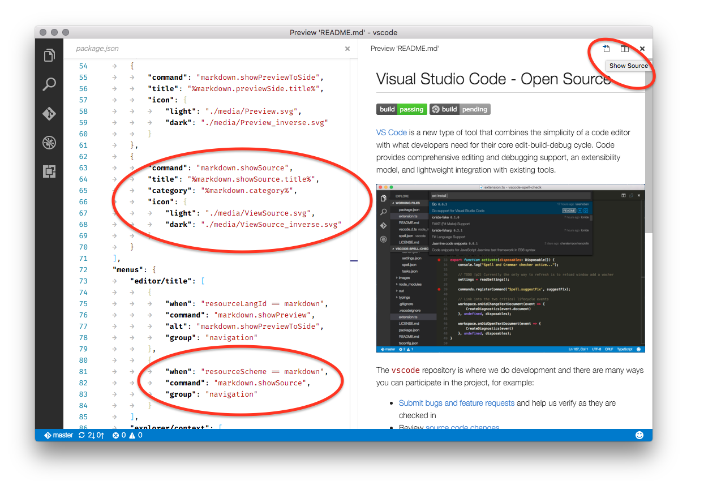
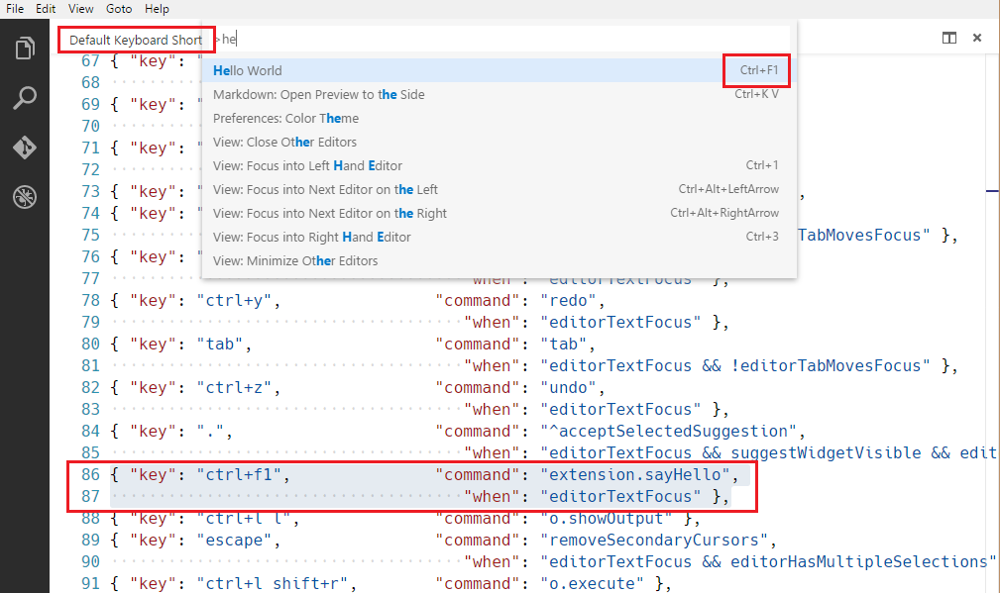
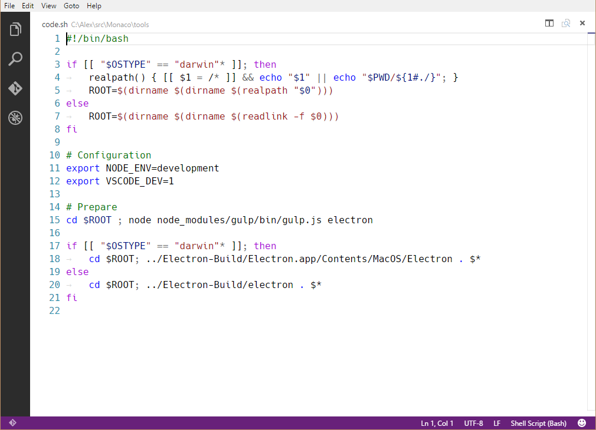
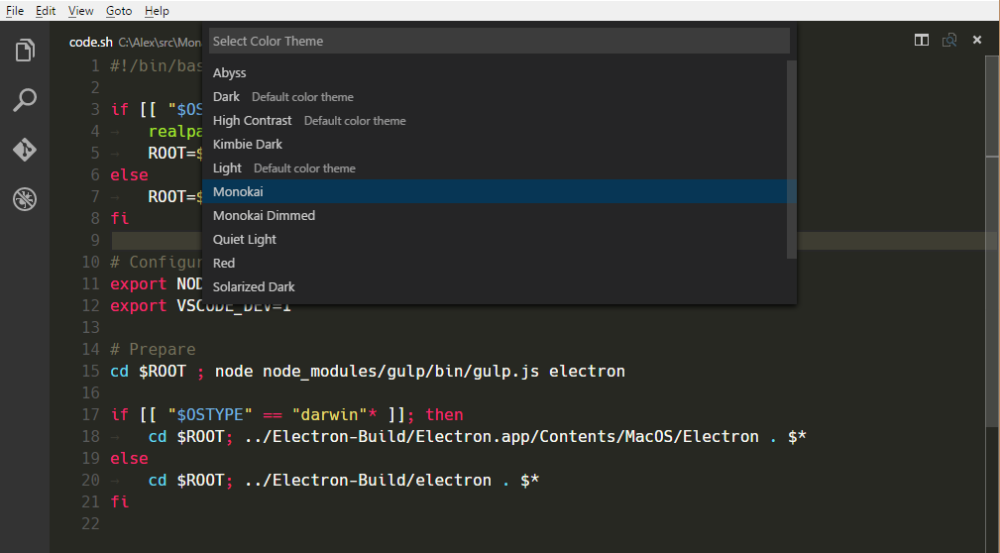
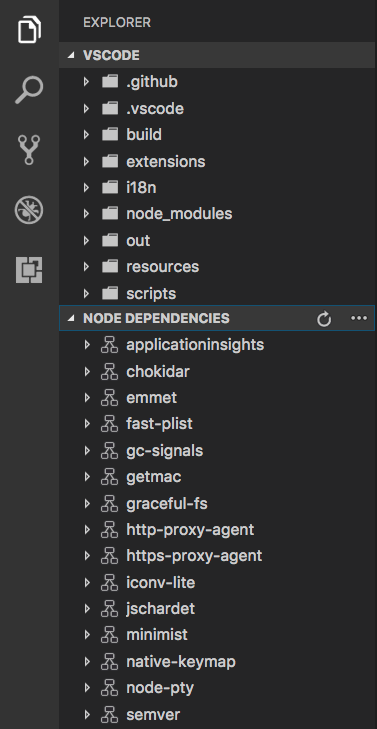
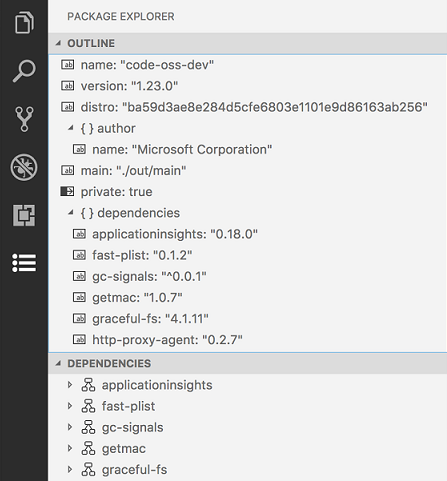

---
---

# Contribution Points

**Contribution Points** is a set of JSON declarations that you make in the `contributes` field of the `package.json` [Extension Manifest](/api/references/extension-manifest). Your extension registers **Contribution Points** to extend various functionalities within Visual Studio Code. Here is a list of all available **Contribution Points**:

- [`configuration`](/api/references/contribution-points#contributes.configuration)
- [`commands`](/api/references/contribution-points#contributes.commands)
- [`menus`](/api/references/contribution-points#contributes.menus)
- [`keybindings`](/api/references/contribution-points#contributes.keybindings)
- [`languages`](/api/references/contribution-points#contributes.languages)
- [`debuggers`](/api/references/contribution-points#contributes.debuggers)
- [`breakpoints`](/api/references/contribution-points#contributes.breakpoints)
- [`grammars`](/api/references/contribution-points#contributes.grammars)
- [`themes`](/api/references/contribution-points#contributes.themes)
- [`snippets`](/api/references/contribution-points#contributes.snippets)
- [`jsonValidation`](/api/references/contribution-points#contributes.jsonValidation)
- [`views`](/api/references/contribution-points#contributes.views)
- [`viewsContainers`](/api/references/contribution-points#contributes.viewsContainers)
- [`problemMatchers`](/api/references/contribution-points#contributes.problemMatchers)
- [`problemPatterns`](/api/references/contribution-points#contributes.problemPatterns)
- [`taskDefinitions`](/api/references/contribution-points#contributes.taskDefinitions)
- [`colors`](/api/references/contribution-points#contributes.colors)

## contributes.configuration

Contribute configuration keys that will be exposed to the user. The user will be able to set these configuration options either from User Settings or from the Workspace Settings.

When contributing configuration keys, a JSON schema describing these keys is actually contributed. This ensures the user gets great tooling support when authoring VS Code settings files.

You can read these values from your extension using `vscode.workspace.getConfiguration('myExtension')`.

>**Note:** If you use `markdownDescription` instead of `description`, your setting description will be rendered as Markdown in the settings UI.

### Example

```json
"contributes": {
    "configuration": {
        "type": "object",
        "title": "TypeScript configuration",
        "properties": {
            "typescript.useCodeSnippetsOnMethodSuggest": {
                "type": "boolean",
                "default": false,
                "description": "Complete functions with their parameter signature."
            },
            "typescript.tsdk": {
                "type": ["string", "null"],
                "default": null,
                "description": "Specifies the folder path containing the tsserver and lib*.d.ts files to use."
            }
        }
    }
}
```


## contributes.configurationDefaults

Contribute default language specific editor configurations. This will override default editor configurations for the provided language.

The following example contributes default editor configurations for the `markdown` language:

### Example

```json
"contributes": {
    "configurationDefaults": {
        "[markdown]": {
            "editor.wordWrap": "on",
            "editor.quickSuggestions": false
        }
    }
}
```

## contributes.commands

Contribute an entry consisting of a title and a command to invoke to the **Command Palette** (`kb(workbench.action.showCommands)`). You can also optionally define a `category` string which will prefix the command title and allow easy grouping within the **Command Palette** drop-down.

>**Note:** When a command is invoked (from a key binding or from the **Command Palette**), VS Code will emit an activationEvent `onCommand:${command}`.

### Example

```json
"contributes": {
    "commands": [{
        "command": "extension.sayHello",
        "title": "Hello World",
        "category": "Hello"
    }]
}
```



## contributes.menus

Contribute a menu item for a command to the editor or Explorer. The menu item definition contains the command that should be invoked when selected and the condition under which the item should show. The latter is defined with the `when` clause which uses the key bindings [when clause contexts](/docs/getstarted/keybindings.md#when-clause-contexts).

In addition to the mandatory `command` property, an alternative command can be defined using the `alt`-property. It will be shown and invoked when pressing `kbstyle(Alt)` while opening a menu.

Last, a `group`-property defines sorting and grouping of menu items. The `navigation` group is special as it will always be sorted to the top/beginning of a menu.

Currently extension writers can contribute to:

* The global Command Palette - `commandPalette`
* The Explorer context menu - `explorer/context`
* The editor context menu - `editor/context`
* The editor title menu bar - `editor/title`
* The editor title context menu - `editor/title/context`
* The debug callstack view context menu - `debug/callstack/context`
* The [SCM title menu](/api/extension-guides/scm-provider#menus) - `scm/title`
* [SCM resource groups](/api/extension-guides/scm-provider#menus) menus - `scm/resourceGroup/context`
* [SCM resources](/api/extension-guides/scm-provider#menus) menus - `scm/resource/context`
* [SCM change title](/api/extension-guides/scm-provider#menus) menus - `scm/change/title`
* The [View title menu](/api/references/contribution-points#contributes.views) - `view/title`
* The [View item menu](/api/references/contribution-points#contributes.views) - `view/item/context`

>**Note:** When a command is invoked from a (context) menu, VS Code tries to infer the currently selected resource and passes that as a parameter when invoking the command. For instance, a menu item inside the Explorer is passed the URI of the selected resource and a menu item inside an editor is passed the URI of the document.

In addition to a title, commands can also define icons which VS Code will show in the editor title menu bar.

### Example

```json
"contributes": {
    "menus": {
        "editor/title": [{
            "when": "resourceLangId == markdown",
            "command": "markdown.showPreview",
            "alt": "markdown.showPreviewToSide",
            "group": "navigation"
        }]
    }
}
```



### Context specific visibility of Command Palette menu items

When registering commands in `package.json`, they will automatically be shown in the **Command Palette** (`kb(workbench.action.showCommands)`). To allow more control over command visibility, there is the `commandPalette` menu item. It allows you to define a `when` condition to control if a command should be visible in the **Command Palette** or not.

The snippet below makes the 'Hello World' command only visible in the **Command Palette** when something is selected in the editor:

```json
"commands": [{
    "command": "extension.sayHello",
    "title": "Hello World"
}],
"menus": {
    "commandPalette": [{
        "command": "extension.sayHello",
        "when": "editorHasSelection"
    }]
}
```

### Sorting of groups

Menu items can be sorted into groups. They are sorted in lexicographical order with the following defaults/rules.
You can add menu items to these groups or add new groups of menu items in between, below, or above.

The **editor context menu**  has these default groups:

* `navigation` - The `navigation` group comes first in all cases.
* `1_modification` - This group comes next and contains commands that modify your code.
* `9_cutcopypaste` - The second last default group with the basic editing commands.
* `z_commands` - The last default group with an entry to open the Command Palette.


The **explorer context menu** has these default groups:

* `navigation` -  Commands related to navigation across VS Code. This group comes first in all cases.
* `2_workspace` - Commands related to workspace manipulation.
* `3_compare` - Commands related to comparing files in the diff editor.
* `4_search` - Commands related to searching in the search view.
* `5_cutcopypaste` - Commands related to cutting, copying and pasting of files.
* `7_modification` - Commands related to the modification of a files.

The **editor tab context menu** has these default groups:

* `1_close` - Commands related to closing editors.
* `3_preview` - Commands related to pinning editors.

The **editor title menu** has these default groups:

* `1_diff` - Commands related to working with diff editors.
* `3_open` - Commands related to opening editors.
* `5_close` - Commands related to closing editors.


### Sorting inside groups

The order inside a group depends on the title or an order-attribute. The group-local order of a menu item is specified by appending `@<number>` to the group identifier as shown below:

```json
"editor/title": [{
    "when": "editorHasSelection",
    "command": "extension.Command",
    "group": "myGroup@1"
}]
```

## contributes.keybindings

Contribute a key binding rule defining what command should be invoked when the user presses a key combination. See the [Key Bindings](/docs/getstarted/keybindings) topic where key bindings are explained in detail.

Contributing a key binding will cause the Default Keyboard Shortcuts to display your rule, and every UI representation of the command will now show the key binding you have added. And, of course, when the user presses the key combination the command will be invoked.

>**Note:** Because VS Code runs on Windows, macOS and Linux, where modifiers differ, you can use "key" to set the default key combination and overwrite it with a specific platform.

>**Note:** When a command is invoked (from a key binding or from the Command Palette), VS Code will emit an activationEvent `onCommand:${command}`.

### Example

Defining that `kbstyle(Ctrl+F1)` under Windows and Linux and `kbstyle(Cmd+F1)` under macOS trigger the `"extension.sayHello"` command:

```json
"contributes": {
    "keybindings": [{
        "command": "extension.sayHello",
        "key": "ctrl+f1",
        "mac": "cmd+f1",
        "when": "editorTextFocus"
    }]
}
```



## contributes.languages

Contribute definition of a language. This will introduce a new language or enrich the knowledge VS Code has about a language.

The main effects of `contributes.languages` are:

- Define a `languageId` that can be reused in other parts of VS Code API, such as `vscode.TextDocument.getLanguageId()` and the `onLanguage` Activation Events.
  - You can contribute a human-readable using the `aliases` field. The first item in the list will be used as the human-readable label.
- Associate file name extensions, file name patterns, files that begin with a specific line (such as hashbang), mimetypes to that `languageId`.
- Contribute a set of [Declarative Language Features](/api/language-extensions/overview#declarative-language-features) for the contributed language. Learn more about the configurable editing features in the [Language Configuration Guide](/api/language-extensions/language-configuration-guide).

### Example

```json
...
"contributes": {
    "languages": [{
        "id": "python",
        "extensions": [ ".py" ],
        "aliases": [ "Python", "py" ],
        "filenames": [ ... ],
        "firstLine": "^#!/.*\\bpython[0-9.-]*\\b",
        "configuration": "./language-configuration.json"
    }]
}
```

## contributes.debuggers

Contribute a debugger to VS Code. A debugger contribution has the following properties:

* `type` is a unique ID that is used to identify this debugger in a launch configuration.
* `label` is the user visible name of this debugger in the UI.
* `program` the path to the debug adapter that implements the VS Code debug protocol against the real debugger or runtime.
* `runtime` if the path to the debug adapter is not an executable but needs a runtime.
* `configurationAttributes` is the schema for launch configuration arguments specific to this debugger.
* `initialConfigurations` lists launch configurations that are used to populate an initial launch.json.
* `configurationSnippets` lists launch configurations that are available through IntelliSense when editing a launch.json.
* `variables` introduces substitution variables and binds them to commands implemented by the debugger extension.
* `languages` those languages for which the debug extension could be considered the "default debugger".
* `adapterExecutableCommand` the command ID where the debug adapters executable path and arguments are dynamically calculated. The command returns a structure with this format:
  ```json
  command: "<executable>",
  args: [ "<argument1>", "<argument2>", ... ]
  ```
  The attribute `command` must be a either an absolute path to an executable or a name of executable looked up via the PATH environment variable. The special value `node` will be mapped to VS Code's built-in node runtime without being looked up on the PATH.

### Example

```json
"contributes": {
    "debuggers": [{
        "type": "node",
        "label": "Node Debug",

        "program": "./out/node/nodeDebug.js",
        "runtime": "node",

        "languages": ["javascript", "typescript", "javascriptreact", "typescriptreact"],

        "configurationAttributes": {
            "launch": {
                "required": [ "program" ],
                "properties": {
                    "program": {
                        "type": "string",
                        "description": "The program to debug."
                    }
                }
            }
        },

        "initialConfigurations": [{
            "type": "node",
            "request": "launch",
            "name": "Launch Program",
            "program": "${workspaceFolder}/app.js"
        }],

        "configurationSnippets": [
            {
                "label": "Node.js: Attach Configuration",
                "description": "A new configuration for attaching to a running node program.",
                "body": {
                    "type": "node",
                    "request": "attach",
                    "name": "${2:Attach to Port}",
                    "port": 9229
                }
            }
        ],

        "variables": {
            "PickProcess": "extension.node-debug.pickNodeProcess"
        }
    }]
}
```

For a full walkthrough on how to integrate a `debugger`, go to [Debuggers](/docs/extensions/example-debuggers).

## contributes.breakpoints

Usually a debugger extension will also have a `contributes.breakpoints` entry where the extension lists the language file types for which setting breakpoints will be enabled.

```json
"contributes": {
    "breakpoints": [
        {
            "language": "javascript"
        },
        {
            "language": "javascriptreact"
        }
    ]
}
```

## contributes.grammars

Contribute a TextMate grammar to a language. You must provide the `language` this grammar applies to, the TextMate `scopeName` for the grammar and the file path.

>**Note:** The file containing the grammar can be in JSON (filenames ending in .json) or in XML plist format (all other files).

### Example

```json
"contributes": {
    "grammars": [{
        "language": "markdown",
        "scopeName": "text.html.markdown",
        "path": "./syntaxes/markdown.tmLanguage.json",
        "embeddedLanguages": {
            "meta.embedded.block.frontmatter": "yaml",
            ...
        }
    }]
}
```

See [Adding Language Colorization](/docs/extensions/themes-snippets-colorizers) for instructions on using the [yo code extension generator](/docs/extensions/yocode) to quickly package TextMate .tmLanguage files as VS Code extensions.



## contributes.themes

Contribute a TextMate theme to VS Code. You must specify a label, whether the theme is a dark theme or a light theme (such that the rest of VS Code changes to match your theme) and the path to the file (XML plist format).

### Example

```json
"contributes": {
    "themes": [{
        "label": "Monokai",
        "uiTheme": "vs-dark",
        "path": "./themes/Monokai.tmTheme"
    }]
}
```



See [Changing the Color Theme](/docs/extensions/themes-snippets-colorizers) for instructions on using the [yo code extension generator](/docs/extensions/yocode) to quickly package TextMate .tmTheme files as VS Code extensions.

## contributes.snippets

Contribute snippets for a specific language. The `language` attribute is the [language identifier](/docs/languages/identifiers) and the `path` is the relative path to the snippet file, which defines snippets in the [VS Code snippet format](/docs/editor/userdefinedsnippets.md#snippet-syntax).

The example below shows adding snippets for the Go language.

```json
"contributes": {
    "snippets": [{
        "language": "go",
        "path": "./snippets/go.json"
    }]
}
```

## contributes.jsonValidation

Contribute a validation schema for a specific type of `json` file.  The `url` value can be either a local path to a schema file included in the extension or a remote server URL such as a [json schema store](http://schemastore.org/json).

```json
"contributes": {
    "jsonValidation": [{
        "fileMatch": ".jshintrc",
        "url": "http://json.schemastore.org/jshintrc"
    }]
}
```

## contributes.views

Contribute a view to VS Code. You must specify an identifier and name for the view. You can contribute to following view containers:

* `explorer`: Explorer view container in the Activity Bar
* `scm`: Source Control Management (SCM) view container in the Activity Bar
* `debug`: Debug view container in the Activity Bar
* `test`: Test view container in the Activity Bar
* [Custom view containers](#contributes.viewsContainers) contributed by Extensions.

When the user opens the view, VS Code will then emit an activationEvent `onView:${viewId}` (e.g. `onView:nodeDependencies` for the example below). You can also control the visibility of the view by providing the `when` context value.

```json
"contributes": {
    "views": {
        "explorer": [
            {
                "id": "nodeDependencies",
                "name": "Node Dependencies",
                "when": "workspaceHasPackageJSON"
            }
        ]
    }
}
```



Extension writers should create a [TreeView](https://code.visualstudio.com/docs/extensionAPI/vscode-api#TreeView) by providing a [data provider](https://code.visualstudio.com/docs/extensionAPI/vscode-api#TreeDataProvider) through `createTreeView` API or register the [data provider](https://code.visualstudio.com/docs/extensionAPI/vscode-api#TreeDataProvider) directly through `registerTreeDataProvider` API to populate data. Refer to examples [here](https://github.com/Microsoft/vscode-extension-samples/tree/master/tree-view-sample).

## contributes.viewsContainers

Contribute a view container into which [Custom views](#contributes.views) can be contributed. You must specify an identifier, title and an icon for the view container. At present, you can contribute them to the Activity Bar (`activitybar`) only. Below example shows how the `Package Explorer` view container is contributed to the Activity Bar and how views are contributed to it.

```json
"contributes": {
        "viewsContainers": {
            "activitybar": [
                {
                    "id": "package-explorer",
                    "title": "Package Explorer",
                    "icon": "resources/package-explorer.svg"
                }
            ]
        },
        "views": {
            "package-explorer": [
                {
                    "id": "package-dependencies",
                    "name": "Dependencies"
                },
                {
                    "id": "package-outline",
                    "name": "Outline"
                }
            ]
        }
}
```



**Icon specifications**

* `Size:` Icons are 28x28 centered on a 50x40 block.
* `Color:` Icons should use a single monochrome color.
* `Format:` It is recommended that icons be in SVG, though any image file type is accepted.
* `States:` All icons inherit the following state styles:

  |State|Opacity
  |-|-|
  |Default|60%
  |Hover|100%
  |Active|100%

## contributes.problemMatchers

Contribute problem matcher patterns. These contributions work in both the output panel runner and in the terminal runner. Below is an example to contribute a problem matcher for the gcc compiler in an extension:

```json
"contributes": {
    "problemMatchers": [
        {
            "name": "gcc",
            "owner": "cpp",
            "fileLocation": ["relative", "${workspaceFolder}"],
            "pattern": {
                "regexp": "^(.*):(\\d+):(\\d+):\\s+(warning|error):\\s+(.*)$",
                "file": 1,
                "line": 2,
                "column": 3,
                "severity": 4,
                "message": 5
            }
        }
    ]
}
```

This problem matcher can now be used in a `tasks.json` file via a name reference `$gcc`. An example looks like this:

```json
{
    "version": "2.0.0",
    "tasks": [
        {
            "label": "build",
            "command": "gcc",
            "args": ["-Wall", "helloWorld.c", "-o", "helloWorld"],
            "problemMatcher": "$gcc"
        }
    ]
}
```

Also see: [Defining a Problem Matcher](/docs/editor/tasks.md#defining-a-problem-matcher)

## contributes.problemPatterns

Contributes named problem patterns that can be used in problem matchers (see above).

## contributes.taskDefinitions

Contributes and defines an object literal structures that allows to uniquely identifiy a contributed task in the system. A task definition has at minimum a `type` property but it usually defines additional propertiies. For example a task definition for a task representing a script in a package.json file looks like this:

```json
"taskDefinitions": [
    {
        "type": "npm",
        "required": [
            "script"
        ],
        "properties": {
            "script": {
                "type": "string",
                "description": "The script to execute"
            },
            "path": {
                "type": "string",
                "description": "The path to the package.json file. If omitted the package.json in the root of the workspace folder is used."
            }
        }
    }
]
```

The task definition is defined using JSON schema syntax for the `required` and `properties` property. The `type` property definies the task type. If the above example:

* `"type": "npm"` associates the task definition with the npm tasks
* `"required": [ "script" ]` defines that `script` attributes as mandatory. The `path` property is optional.
* `"properties"` : { ... }` defines the additional properties and their types.

When the extension actual creates a Task it needs to pass a `TaskDefinition` that conforms to the task definition contributed in the package.json file. For the `npm` example a task creation for the test script inside a package.json file looks like this:

```ts
let task = new vscode.Task({ type: 'npm', script: 'test' }, ....);
```


## contributes.colors

Contributes new themable colors. These colors can be used by the extension in editor decorators and in the status bar. Once defined, users can customize the color in the `workspace.colorCustomization` setting and user themes can set the color value.

```json
"contributes": {
  "colors": [{
      "id": "superstatus.error",
      "description": "Color for error message in the status bar.",
      "defaults": {
          "dark": "errorForeground",
          "light": "errorForeground",
          "highContrast": "#010203"
      }
  }]
}
```

Color default values can be defined for light, dark and high contrast theme and can either be a reference to an existing color or a [Color Hex Value](/docs/getstarted/theme-color-reference.md#colorformats).

## contributes.typescriptServerPlugins

Contributes [TypeScript server plugins](https://github.com/Microsoft/TypeScript/wiki/Writing-a-Language-Service-Plugin) that augment VS Code's JavaScript and TypeScript support:

```json
"contributes": {
   "typescriptServerPlugins": [
      {
        "name": "typescript-styled-plugin"
      }
    ]
}
```

The above example extension contributes the [`typescript-styled-plugin`](https://github.com/Microsoft/typescript-styled-plugin) which adds styled-component IntelliSense for JavaScript and TypeScript. This plugin will be loaded from the extension and must be listed as a `dependency`:

```json
{
    "dependencies": {
        "typescript-styled-plugin": "*"
    }
}
```

TypeScript server plugins are loaded for all JavaScript and TypeScript files when the user is using VS Code's version of TypeScript. They are not activated if the user is using a workspace version of TypeScript.

## Next Steps

To learn more about VS Code extensibility model, try these topic:

* [Extension Manifest File](/docs/extensionAPI/extension-manifest) - VS Code package.json extension manifest file reference
* [Activation Events](/docs/extensionAPI/activation-events) - VS Code activation events reference
