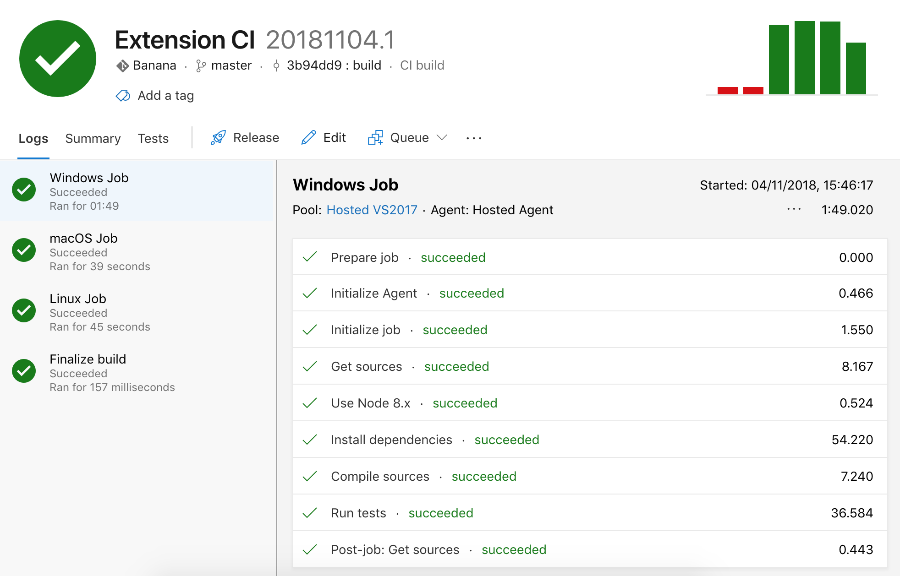

---
---

# Continuous Integration

Extension tests can be run on CI services. The `vscode` npm module provides a built-in command (`bin/test`) which:

1. Downloads and unzips VS Code;
2. Launches your extension tests inside VS Code;
3. Prints the results to the console and exits with an appropriate status code.

The command will expose some optional environment variables, which you can use to customize the build:

| Name        | Description       |
| ------------|-------------------|
| `CODE_VERSION` | Version of VS Code to run the tests against (e.g. `0.10.10`) |
| `CODE_DOWNLOAD_URL` | Full URL of a VS Code drop to use for running tests against |
| `CODE_TESTS_PATH` | Location of the tests to execute (default is `process.cwd()/out/test` or `process.cwd()/test`) |
| `CODE_EXTENSIONS_PATH` | Location of the extensions to load (default is `process.cwd()`) |
| `CODE_TESTS_WORKSPACE` | Location of a workspace to open for the test instance (default is CODE_TESTS_PATH) |

### Azure Pipelines

<a href="https://azure.microsoft.com/services/devops/"></a>

You can create free projects on [Azure DevOps](https://azure.microsoft.com/services/devops/). This gives you source code hosting, planning boards, building and testing infrastructure, and more. On top of that, you get [10 free parallel jobs](https://azure.microsoft.com/services/devops/pipelines/) for building your projects across all 3 major platforms: Windows, macOS and Linux.

After registering and creating your new project, simply add the following `build.yml` to the root of your extension's repository:

```yaml
jobs:
- job: Windows
  pool:
    name: Hosted VS2017
    demands: npm
  steps:
  - task: NodeTool@0
    displayName: 'Use Node 8.x'
    inputs:
      versionSpec: 8.x
  - task: Npm@1
    displayName: 'Install dependencies'
    inputs:
      verbose: false
  - task: Npm@1
    displayName: 'Compile sources'
    inputs:
      command: custom
      verbose: false
      customCommand: 'run compile'
  - script: 'node node_modules/vscode/bin/test'
    displayName: 'Run tests'
- job: macOS
  pool:
    name: Hosted macOS
    demands: npm
  steps:
  - task: NodeTool@0
    displayName: 'Use Node 8.x'
    inputs:
      versionSpec: 8.x
  - task: Npm@1
    displayName: 'Install dependencies'
    inputs:
      verbose: false
  - task: Npm@1
    displayName: 'Compile sources'
    inputs:
      command: custom
      verbose: false
      customCommand: 'run compile'
  - script: 'node node_modules/vscode/bin/test'
    displayName: 'Run tests'
- job: Linux
  pool:
    name: Hosted Ubuntu 1604
    demands: npm
  steps:
  - task: NodeTool@0
    displayName: 'Use Node 8.x'
    inputs:
      versionSpec: 8.x
  - task: Npm@1
    displayName: 'Install dependencies'
    inputs:
      verbose: false
  - task: Npm@1
    displayName: 'Compile sources'
    inputs:
      command: custom
      verbose: false
      customCommand: 'run compile'
  - script: |
      set -e
      /usr/bin/Xvfb :10 -ac >> /tmp/Xvfb.out 2>&1 &
      disown -ar
    displayName: 'Start xvfb'
  - script: 'node node_modules/vscode/bin/test'
    displayName: 'Run tests'
    env:
      DISPLAY: :10
```

Next [create a new Pipeline](https://docs.microsoft.com/azure/devops/pipelines/get-started-yaml?view=vsts#get-your-first-build) in your DevOps project and point it to the `build.yml` file. Trigger a build and voilá:



You can enable the build to run continuously when pushing to a branch and even on pull requests. [Click here](https://docs.microsoft.com/azure/devops/pipelines/build/triggers) to learn more.

## Next steps

* [Developing Extensions](/docs/extensions/developing-extensions.md) - Learn more about how to run and debug your extension.
* [vsce](/docs/extensions/publish-extension.md) - Publish your extension with the VSCE command line tool.
* [Extension Manifest file](/docs/extensionAPI/extension-manifest.md) - VS Code extension manifest file reference
* [Extension API](/docs/extensionAPI/overview.md) - Learn about the VS Code extensibility APIs


