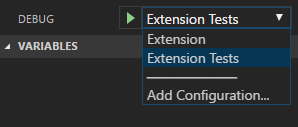
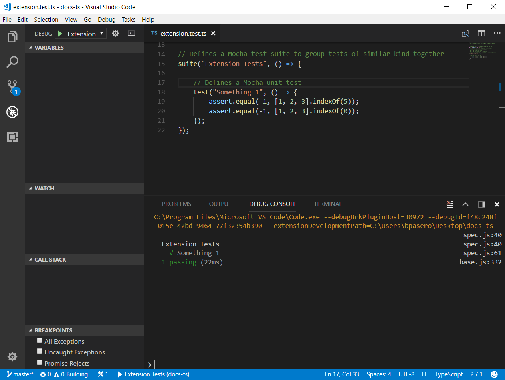

---
# DO NOT TOUCH — Managed by doc writer
ContentId: 2447F8EB-15F1-4279-B621-126C7B8EBF4B
DateApproved: 12/6/2018

# Summarize the whole topic in less than 300 characters for SEO purpose
MetaDescription: Write tests for your Visual Studio Code extension (plug-in).
---

# Testing Extension

Visual Studio Code supports running and debugging tests for your extension. These tests will run inside a special instance of VS Code named the `Extension Development Host`, and have full access to the VS Code API. We refer to these tests as integration tests, because they go beyond unit tests that can run without a VS Code instance. This documentation focuses on VS Code integration tests. For unit testing, you can use any popular testing framework, like [Mocha](https://mochajs.org/) or [Jasmine](https://jasmine.github.io/).

## Yo Code test scaffolding

If you are using the [yo code generator](https://github.com/Microsoft/vscode-generator-code), the generated projects include a sample test and instructions for running the tests.

**Note**: The documentation below assumes that you created a TypeScript extension but the same also applies for a JavaScript extension. However, some file names may be different.

After you've created a new extension and opened the project in VS Code, you can select the `Extension Tests` configuration from the drop-down at the top of the Debug View.



With this configuration chosen, when you run `Debug: Start` (`kb(workbench.action.debug.start)`), VS Code launches your extension in the `Extension Development Host` instance and runs your tests. Test output goes to the Debug Console where you can see the test results.



The generated test uses the [Mocha test framework](https://mochajs.org/) for its test runner and library.

The extension project comes with a `src/test` folder that includes an `index.ts` file which defines the Mocha test runner configuration and an `extension.test.ts` which has the example `Something 1` test. You can typically leave `index.ts` untouched, but you can modify it to adjust the configuration of Mocha.

```
├── src
│   └── test
│       ├── extension.test.ts
│       └── index.ts
```

You can create more `test.ts` files under the `test` folder and they will automatically be built (to `out/test`) and run. The test runner will only consider files matching the name pattern `*.test.ts`.

## Launch tests configuration

The `Extension Tests` configuration is defined in the project's `.vscode\launch.json` file.  It is similar the `Extension` configuration with the addition of the `--extensionTestsPath` argument which points to the compiled test files (assuming this is a TypeScript project).

```json
{
    "name": "Extension Tests",
    "type": "extensionHost",
    "request": "launch",
    "runtimeExecutable": "${execPath}",
    "args": [
        "--extensionDevelopmentPath=${workspaceFolder}",
        "--extensionTestsPath=${workspaceFolder}/out/test"
    ],
    "outFiles": [
        "${workspaceFolder}/out/test/**/*.js"
    ]
}
```

## Passing arguments to the Extension Development Host

You can set the file or folder that the test instance should open by inserting the path at the front of the argument list for the launch configuration.

```json
"args": [
    "file or folder name",
    "--extensionDevelopmentPath=${workspaceFolder}",
    "--extensionTestsPath=${workspaceFolder}/out/test"
]
```

This way you can run your tests with predictable content and folder structure.

## Disabling other extensions

By default, the debug instance of VS Code will load any extension you've previously installed alongside the one you are developing. If you want to disable those extensions, add `"--disable-extensions"` to the argument list in the launch configuration.

```json
"args": [
    "--disable-extensions",
    "--extensionDevelopmentPath=${workspaceFolder}",
    "--extensionTestsPath=${workspaceFolder}/out/test"
]
```

This will give large benefits to performance when running tests

## Excluding test files from your extension package

If you decide to share your extension, you may not want to include the tests in your extension package.  The [`.vscodeignore`](/docs/extensions/publish-extension.md#advance-usage) file lets you exclude test files when you package and publish your extension with the [`vsce` publishing tool](/api/working-with-extensions/publishing-extension).  By default, the `yo code` generated extension project excludes the `test` and `out/test` folders.

```
out/test/**
```

## Next steps

* [Continuous Integration](/api/working-with-extensions/continuous-integration) - Run your extension tests in a Continuous Integration service such as Azure DevOps.