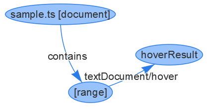
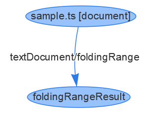

## Rich Code Navigation without Checkout

There are many scenarios where the focus of a developer is on reading and comprehending code and not on authoring new code. Examples are:

- browsing an existing code version in a repository (e.g. on GitHub) without requiring to clone and check it out locally.
- browsing a pull request without being limited to the changed files or being forced to check out the pull request locally. This feature got demoed on [Connect(); 2018](https://news.microsoft.com/connect-2018/) and is powered by LSIF. The blog post [A first look at rich code navigation](https://code.visualstudio.com/blogs/2018/12/04/rich-navigation) contains a demo.
- browsing dependencies of a project. Projects today have many dependencies and you often need to dive into them to learn about their implementation.

In all of the above scenarios you ideally do not want to check out a branch or clone a repository locally, all you want to do is reading the code. Still, you want to have the same rich code navigation capabilities that you are used to from your editor (e.g. hover info, go to definition, find all references). In the editor these features are usually powered by the [Language Server Protocol](https://microsoft.github.io/language-server-protocol/). Beside code comprehension features the LSP provides rich code authoring features like auto complete or format on type. In addition the result of the rich code navigation features change when the code changes. To provide these features efficiently a language server usually requires the files being on a local disk and even reading parts of the files into memory. The goal of the Language Server Index Format (LSIF) is to augment the LSP protocol to support rich code navigation features without these requirements.

## The Language Server Index Format

Since LSIF (pronounced like "else if") builds on LSP it uses the same requests and data types as defined in LSP. At a high level, LSIF models result data typically returned from the corresponding language server requests. Same as LSP, LSIF  doesn't contain any program symbol information nor does the LSIF define any symbol semantics (e.g. what makes the definition of a symbol or when a method overrides another method). The LSIF therefore doesn't define a symbol database, which is consistent with the LSP itself.

Using LSP data types as the base for LSP has another advantage: it can easily be integrated into tools or servers which already understand LSP.

Lets start with a simple TS file named `sample.ts`:

```typescript
function bar(): void {
}
```

Hovering over `bar()` shows the following hover in VS Code:


This hover information is expressed in LSP using the `Hover` type:

```typescript
export interface Hover {
    /**
     * The hover's content
     */
    contents: MarkupContent | MarkedString | MarkedString[];
    /**
     * An optional range
     */
    range?: Range;
}
```

In the above example the concrete value is:

```typescript
{
  contents: [
    { language: "typescript", value: "function bar(): void" }
  ]
}
```

A client tool would retrieve the hover content from a Language Server by sending a `textDocument/hover` request for document `file:///Users/dirkb/sample.ts` at position `{line: 0, character: 10}`.

The idea of the LSIF is it to define a format that language servers or standalone tools can emit that describes that the tuple `['textDocument/hover', 'file:///Users/dirkb/sample.ts', {line: 0, character: 10}]` resolves to the above hover. The data can then be taken and persisted into a database.

LSP requests are position based, however results typically only vary for ranges and not for single positions. Looking again at the above hover example the hover result is the same for all positions of the identifier `bar`. E.g. a user gets the same result whether he hovers over `b` in `bar` or over `r` in `bar`. To make the emitted data more compact the LSIF will use ranges instead of positions. For the above example this means that the LSIF tool will emit that the tuple `['textDocument/hover', 'file:///Users/dirkb/sample.ts', { start: { line: 0, character: 9 }, end: { line: 0, character: 12 }]` resolves to the hover.


LSIF emits this information as a graph, where edges represent the LSP request and vertices are documents, ranges or request results (e.g the hover). We choose this format for the following reasons:

- for a given range there can be multiple results. Looking at the above function `foo` example an interesting code navigation request would also be to find all references. So we need to link that result to the same range.
- it should be possible to emit data as soon as it is available to allow streaming rather than having to store large amounts of data in memory. For example, emitting data for a document should be done for each file as the parsing progresses.
- it should be possible to extend the format with additional request types.

For the concrete Hover example the emitted LSIF data looks as follows:

```typescript
// a vertex representing the document
{ id: 1, type: "vertex", label: "document", uri: "file:///Users/dirkb/sample.ts", languageId: "typescript" }
// a vertex representing the range for the identifier bar
{ id: 4, type: "vertex", label: "range", start: { line: 0, character: 9}, end: { line: 0, character: 12 } }
// an edge saying that the document with id 1 contains the range with id 4
{ id: 5, type: "edge", label: "contains", outV: 1, inV: 4}
// a vertex representing the actual hover result
{ id: 6, type: "vertex", label: "hoverResult",
  result: {
    contents: [
      { language: "typescript", value: "function bar(): void" }
    ]
  }
}
// an edge linking the hover result to the range.
{ id: 7, type: "edge", label: "textDocument/hover", outV: 4, inV: 6 }
```

The corresponding graph looks like this:



The LSP support requests that only take a documents as a parameter (they are not position based). Some of them are interesting for code comprehension features as well. Examples are to list all document symbols or to compute all folding ranges. These requests are modeled in LSIF in the form `[request, document]` -> result. Lets look at a concrete example:

```typescript
function bar(): void {
  console.log('Hello World!');
}
```

The folding range result for the document containing above function bar is emitted like this:

```typescript
// a vertex representing the document
{ id: 1, type: "vertex", label: "document", uri: "file:///Users/dirkb/sample.ts", languageId: "typescript" }
// a vertex representing the folding result
{ id: 2, type: "vertex", label: "foldingRangeResult", result: [ { startLine: 0, startCharacter: 20, endLine: 2, endCharacter: 1 } ] }
// an edge connecting the folding result to the document.
{ id: 3, type: "edge", label: "textDocument/foldingRange", outV: 1, inV: 2 }
```



## How to get started

If you want to get started with LSIF you can have a look at the following resources:

- The actual [LSIF specification](https://github.com/Microsoft/language-server-protocol/blob/master/indexFormat/specification.md)
- [Index for TypeScript](https://github.com/Microsoft/lsif-typescript): generates LSIF for TypeScript. The corresponding readme has steps for how to use it.
- [VS Code extension for LSIF](https://github.com/Microsoft/vscode-lsif-extension): an extension for VS Code to provide language comprehension feature from an LSIF JSON dump. When you have implemented an LSIF generator then you can use this extension to validate it with arbitrary source code.

## We need your feedback!

At this point we think we have made enough progress to share the LSIF specification and we wanted to start an open conversation with the community about what we're working on. For feedback please comment on the issue [Language Server Index Format](https://github.com/Microsoft/language-server-protocol/issues/623).