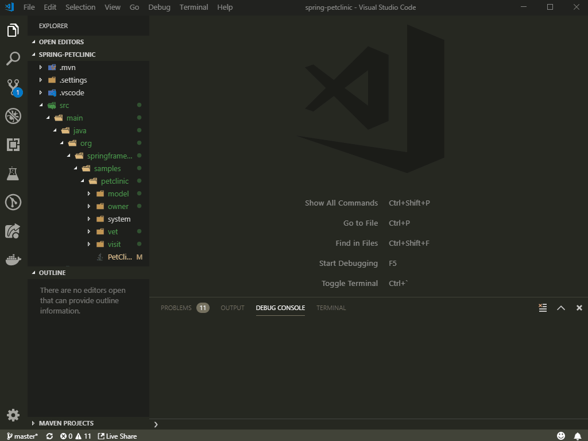
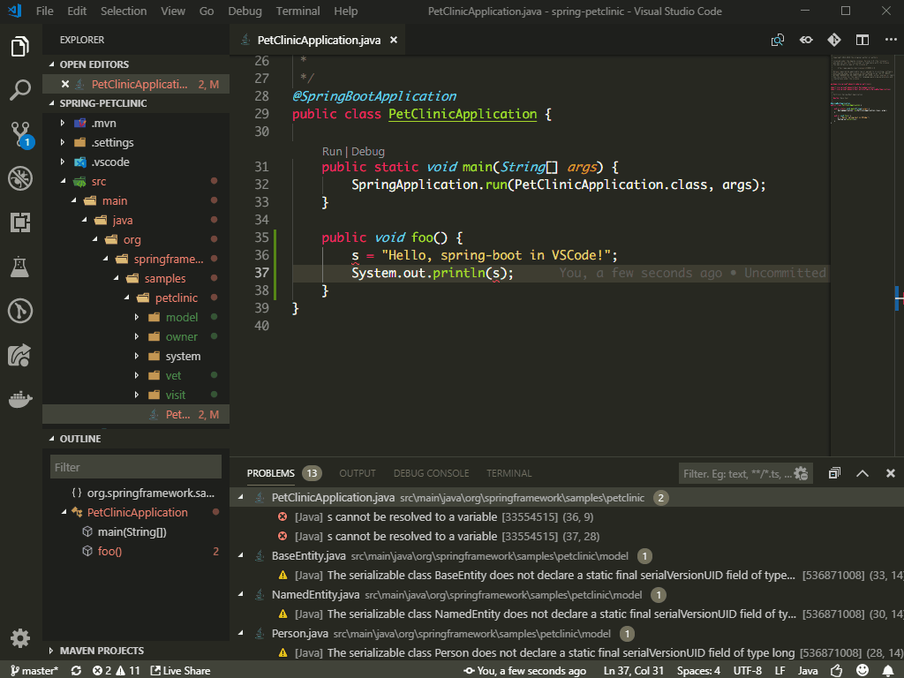
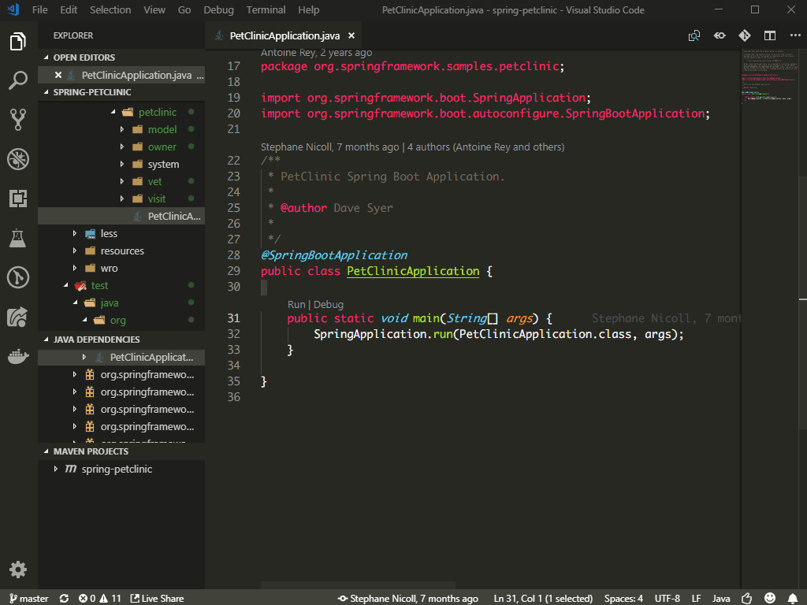
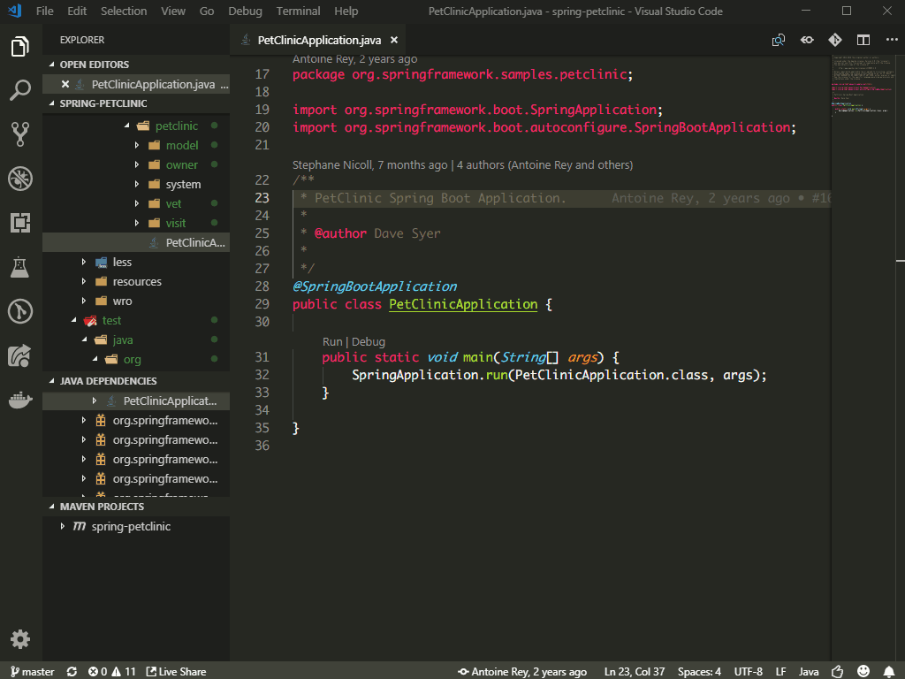
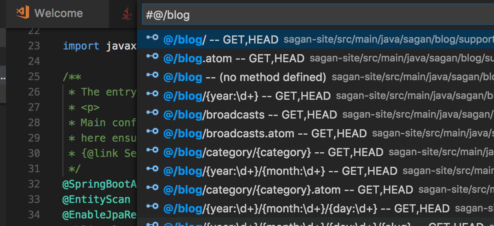
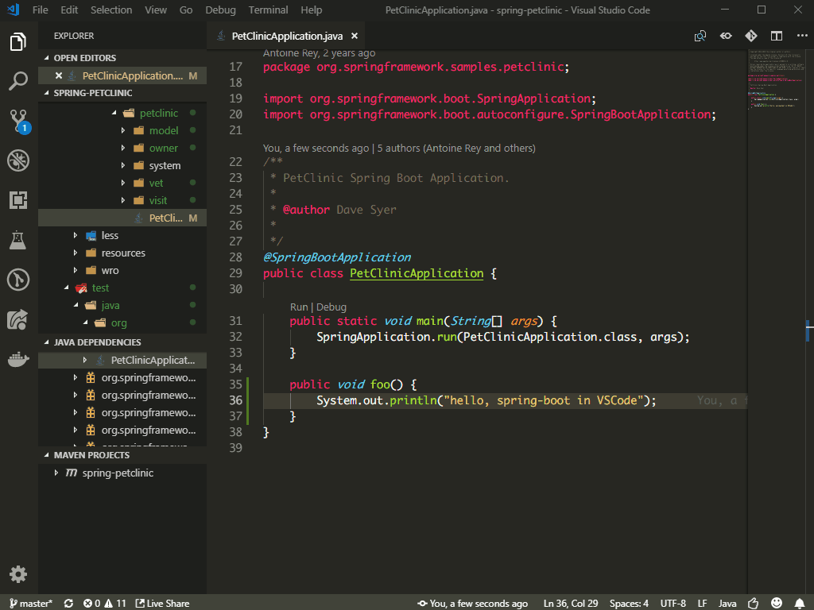
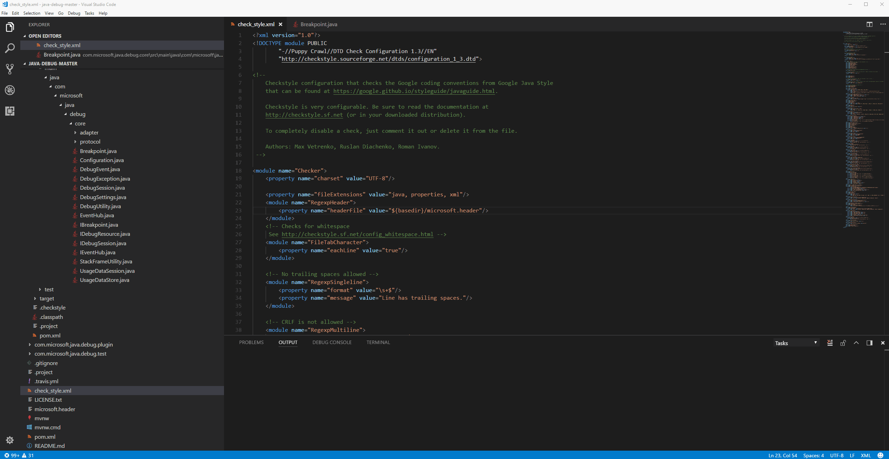

# Editing Java in Visual Studio Code

As a code editor-centric development tool, Visual Studio Code has a lot of editing [features](https://code.visualstudio.com/docs/editor/codebasics). In this document, we will go through a few Java specific things which are helpful when working with Java.

## Code Editing and Navigating

With the support of [outline view](https://code.visualstudio.com/updates/v1_25#_outline-view), you can conveniently navigate your method within the same class. Editing code is also easy with the support of IntelliSense. You can use code snippets as well as various code actions such as generating Getters/Setters and organizing imports to further boost your productivity.

Java support in Visual Studio Code detects issues within your code automatically, and provides you quick fix suggestions on the fly.

As a Java editor, it also supports CodeLens (references), Javadoc hovers and Highlights out of box.

### Search for symbols

You can search for symbols in the current file or workspace to navigate your code more quickly.

To search for a symbol in the current file, use __Quick Open__ (`kb(workbench.action.quickOpen)`) then enter the '@' command, then enter the name of the symbol you're looking for. A list of potential matches will appear and be filtered as you type. Choose from the list of matches to navigate to its location.

To search for a symbol in the current workspace, start by pressing `kb(workbench.action.showAllSymbols)`, then enter the name of the symbol. A list of potential matches will appear as before. If you choose a match that was found in a file that's not already open, the file will be opened before navigating to the match's location. Alternatively, you can also use  __Quick Open__ (`kb(workbench.action.quickOpen)`) then enter the '#' command to search the current workspace. `kb(workbench.action.showAllSymbols)` is just the shortcut for the '#' commands, respectively, so everything works the same.

### Peek Definition

You can take a quick look at how a symbol was defined by using the Peek Definition feature. This feature displays a few lines of code near the definition inside a peek window, so you can take a look without navigating away from your current location.

To peek at a symbol's definition, place your cursor on the symbol anywhere it's used in your source code and then press `kb(editor.action.peekDefinition)`. Alternatively, you can choose __Peek Definition__ from the context menu (right-click, then choose __Peek Definition__).

### Go to Definition

You can also quickly navigate to where a symbol is defined by using the Go to Definition feature.

To go to a symbol's definition, place your cursor on the symbol anywhere it is used in your source code and then press `kb(editor.action.revealDefinition)`. Alternatively, you can choose __Go to Definition__ from the context menu (right-click, then choose __Go to Definition__). When there's only one definition of the symbol, you'll navigate directly to its location, otherwise the competing definitions are displayed in a peek window as described in the previous section and you have to choose the definition that you want to go to.

### Navigating code with Spring Boot

[Spring Boot Tools](https://marketplace.visualstudio.com/items?itemName=Pivotal.vscode-spring-boot) extension provides even more navigation and code completion support for Spring Boot projects.

* `@/` shows all defined request mappings (mapped path, request method, source location)
* `@+` shows all defined beans (bean name, bean type, source location)
* `@>` shows all functions (prototype implementation)
* `@` shows all Spring annotations in the code

To learn more about Spring Boot support with Visual Studio Code, please read [Spring Boot in Visual Studio Code](/docs/java/java-spring-boot.md).

### IntelliSense

Code completion in Visual Studio Code for Java is provided by [Language Support for Java(TM) by Red Hat](https://marketplace.visualstudio.com/items?itemName=redhat.java). Since the extensions is powered by the same [Java development tools (JDT)](https://www.eclipse.org/jdt/) behind Eclipse, you can expect the same level of competency from that.

In additional, there's also AI-assisted IntelliSense called [IntelliCode](https://visualstudio.microsoft.com/services/intellicode/). It saves you time by putting what you're most likely to use at the top of your completion list. IntelliCode recommendations are based on thousands of open source projects on GitHub each with over 100 stars, so it’s trained on best practices. When combined with the context of your code, the completion list is tailored to promote those practices. Here's IntelliCode for Java in action.

IntelliCode works well with popular Java libraries and frameworks like Java SE and Spring. It will help you whether you are doing monolithic web apps or modern microservices.

## Refactoring

Here we will show you the most used refactoring features for Java in Visual Studio Code, namely rename, extract methods and variables.

### Rename

Rename allows you to rename variables, classes, methods, packages, folders, and almost any Java identifiers. When you rename an identifier, all references to that identifier are also renamed. The shortcut to invoke the Rename refactoring is `F2`. When you invoke the shortcut on an identifier in the editor, a small box displays within the editor itself where you can change the identifier name. When you press Enter, all references to that identifier are changed, too.

### Extract methods and variables

Extract to constant, method and local variables all come handy with Java on Visual Studio Code.

## Formatting

[Language Support for Java(TM) by Red Hat](https://marketplace.visualstudio.com/items?itemName=redhat.java) also provides [formatting settings](https://github.com/redhat-developer/vscode-java/wiki/Formatter-settings). You can export an Eclipse formatter file and then use it for your project in VS Code.

In addition, there's a [Checkstyle for Java](https://marketplace.visualstudio.com/items?itemName=shengchen.vscode-checkstyle) extension which you can use with either some popular `checkstyle` configurations or your customized files.

For more details about [Checkstyle for Java](https://marketplace.visualstudio.com/items?itemName=shengchen.vscode-checkstyle), please visit its [GitHub Repository](https://github.com/jdneo/vscode-checkstyle).