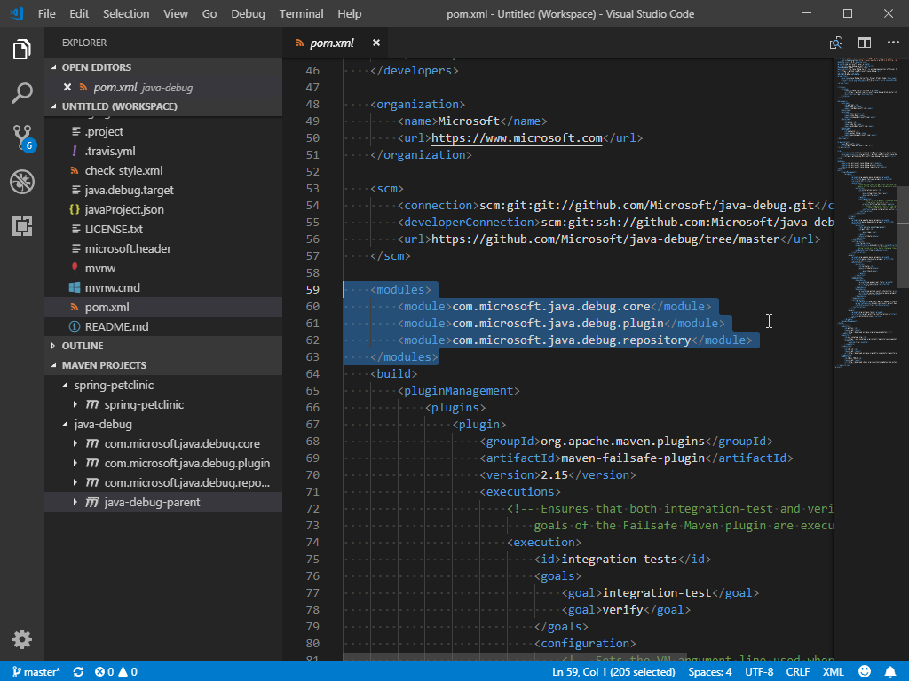
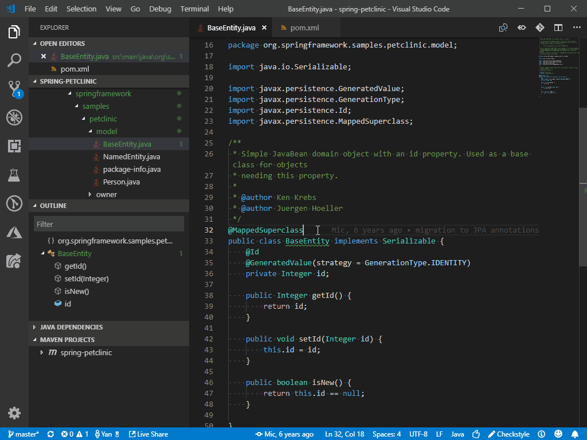
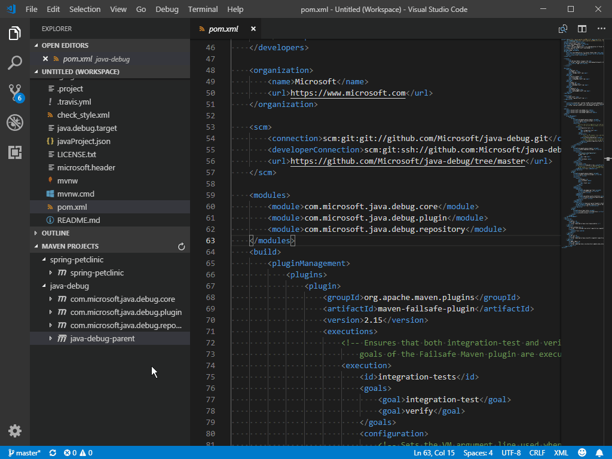
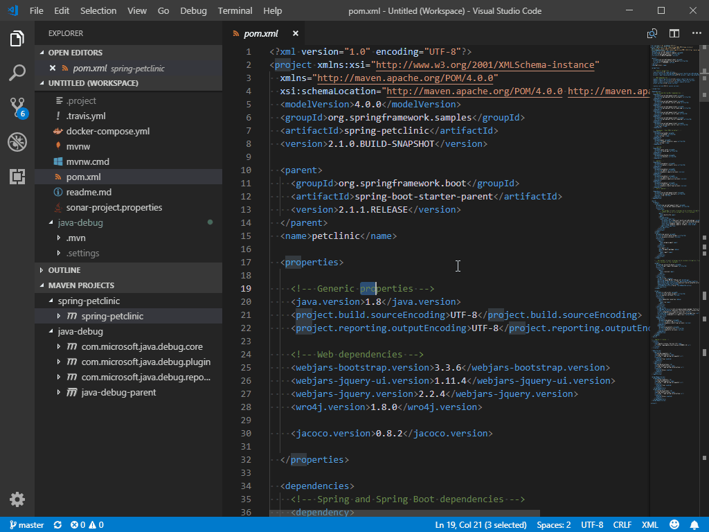
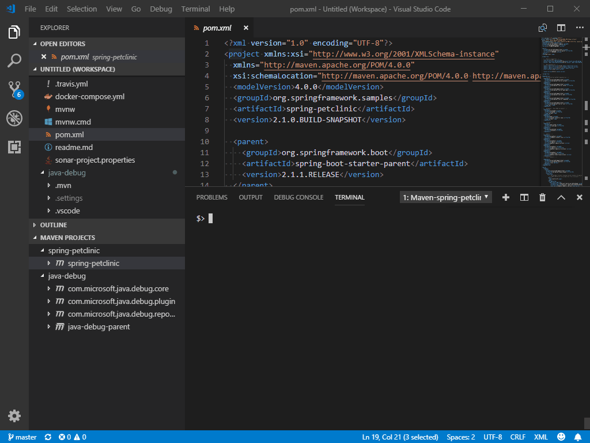
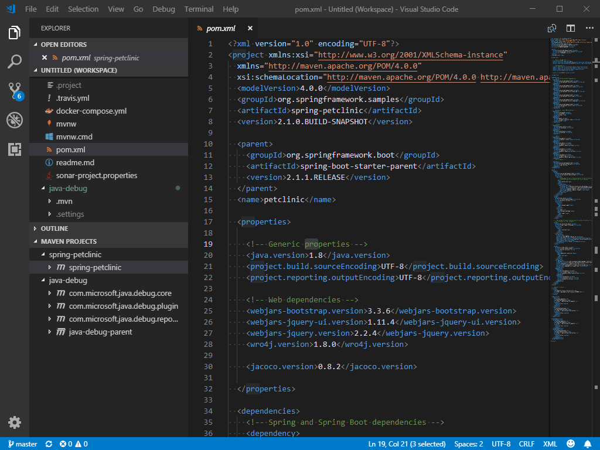
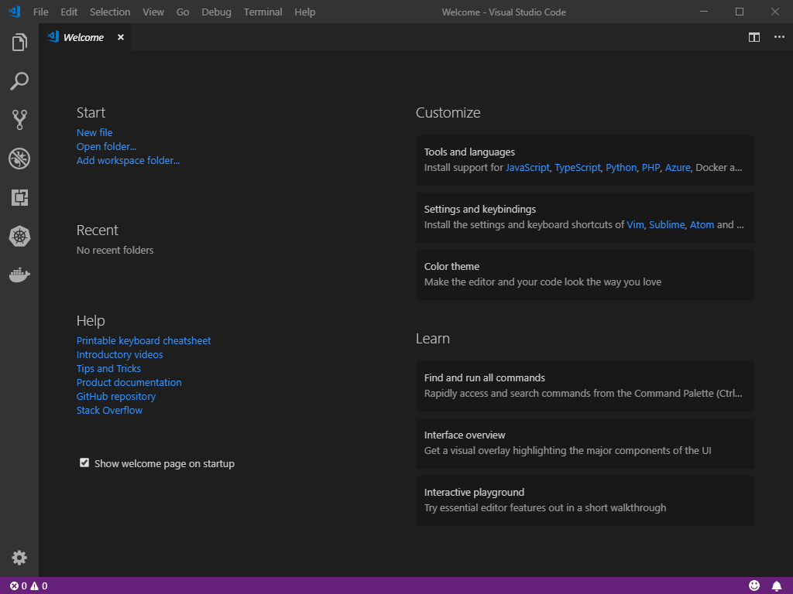
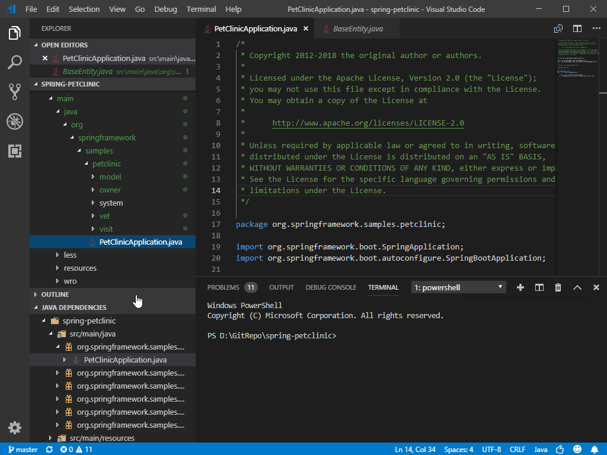

# Java Project Management in VS Code

This document will give you an overview of how to use the [Maven for Java](https://marketplace.visualstudio.com/items?itemName=vscjava.vscode-maven) and [Java Dependency Viewer](https://marketplace.visualstudio.com/items?itemName=vscjava.vscode-java-dependency) extensions to manage your projects within Visual Studio Code.

## Maven

[Maven](http://maven.apache.org/) is a software tool that helps you manage Java projects and automate application builds. The [Maven for Java](https://marketplace.visualstudio.com/items?itemName=vscjava.vscode-maven) extension for Visual Studio Code provides fully integrated Maven support, allowing you to explore Maven projects, execute Maven commands, and perform the goals of build lifecycle and plugins.

### Exploring Maven project

Once a Maven project is loaded, the extension will be activated and it will automatically scan for `pom.xml` files in your workspace and displays all Maven projects and their modules in the side bar.

### Working with POM.xml

The extension provides code snippets and auto completion for adding maven dependencies based on local maven repository. See how easy it is to add a new dependency to your pom.xml with those convenient features.

The extension also enables you to generate effective POM.

### Execute Maven commands and goals

By right-clicking each Maven project in the explorer, you can conveniently run Maven goals.

The extension also preserves the history of goals for each project, so you can quickly rerun the previous command, which is useful when you're running a long custom goal.

There are two way to rerun a goal:

1. Command Palette > Select **Maven: History** > Select a project > Select command from the history.
2. Right-click a project > Click **History** > Select command from history.

For each plug-in you use with your project, the extension also provides you an easy way to access the goals within each plugin.

### Generate project from maven Archetype

Another handy feature provided by this extension is to generate a Maven project from [Archetype](https://maven.apache.org/guides/introduction/introduction-to-archetypes.html). The extension loads archetypes listed in local/remote catalogs. After selection, the extension sends `mvn archetype:generate -D...` to the terminal.

There are two ways to generate a Maven project:

1. From the Command Palette, select **Maven: Generate from Maven Archetype**.
2. Right-click on a folder and select **Generate from Maven Archetype**.

### Additional resources

Visit the [GitHub Repo](https://github.com/Microsoft/vscode-maven) of the Maven extension for additional [configurations](https://github.com/Microsoft/vscode-maven/tree/master#additional-configurations) and a [troubleshooting guide](https://github.com/Microsoft/vscode-maven/blob/master/Troubleshooting.md).

## Project management

Project Management in Visual Studio Code is provided by the [Java Dependency Viewer](https://marketplace.visualstudio.com/items?itemName=vscjava.vscode-java-dependency) extension. This extension has many features including creating projects as well as viewing the package structure of the project and its dependencies.

### Create project

In addition to creating a project through Maven Archetype, you can also use the following command to create a simple Java project: Command Palette > select **Java: Create Java Project**.

If you're creating a Spring Boot project, you can also use the [Spring Initializr](https://marketplace.visualstudio.com/items?itemName=vscjava.vscode-spring-initializr) extension, see [Spring Boot in Visual Studio Code](/docs/java/java-spring-boot.md).

### Package and dependency view

The extension also has a hierarchy view of your project and dependencies, which supplements the file view and outline provided by Visual Studio Code, so you don't need to expand multiple subfolders to just view your Java package.

## Next steps

Read on to find out more about:

* [Java Editing](/docs/java/java-editing.md) - Explore the editing features for Java in VS Code.
* [Java Debugging](/docs/java/java-debugging.md) - Find out how to debug your Java project with VS Code.
* [Java Testing](/docs/java/java-testing.md) - Use VS Code for your JUnit and TestNG cases.
* [Java Extensions](/docs/java/extensions.md) - Learn about more useful Java extensions for VS Code.
