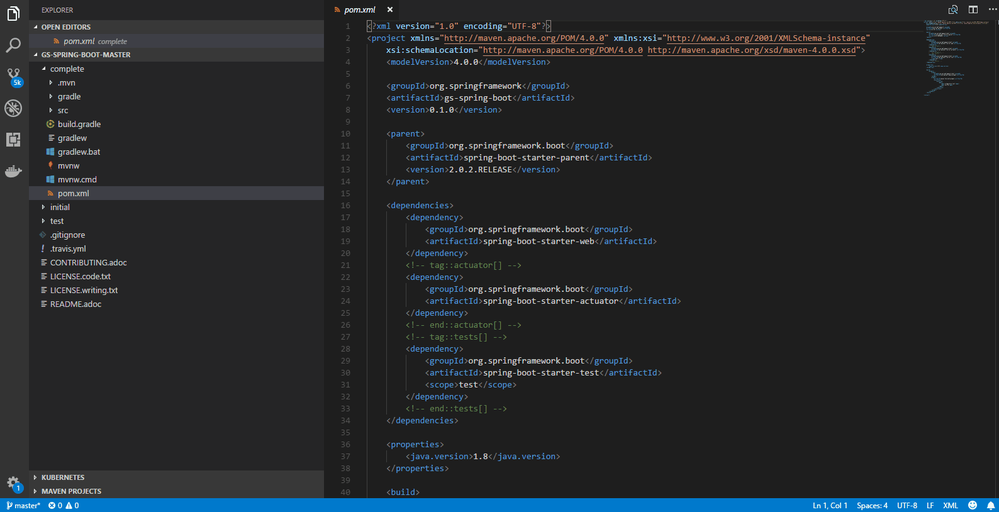
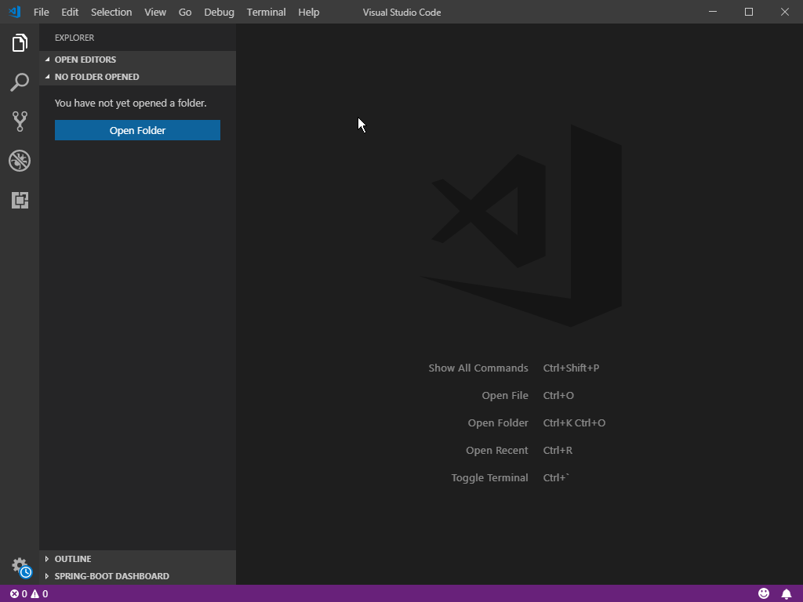
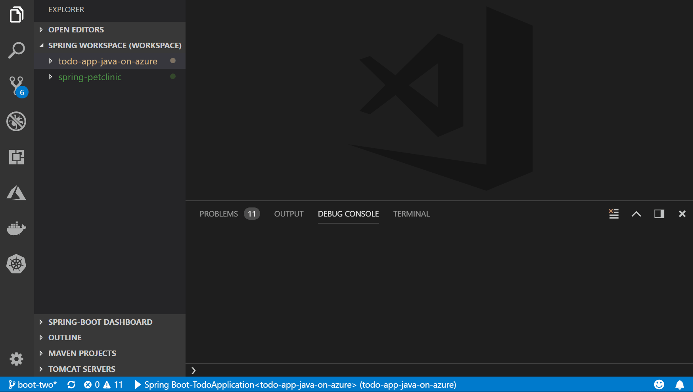

# Spring Boot in Visual Studio Code

Visual Studio Code is an ideal lightweight development environment for Spring Boot application developers and there are several useful VS Code extensions including:

* [Spring Boot Tools](https://marketplace.visualstudio.com/items?itemName=Pivotal.vscode-spring-boot)
* [Spring Initializr](https://marketplace.visualstudio.com/items?itemName=vscjava.vscode-spring-initializr)
* [Spring Boot Dashboard](https://marketplace.visualstudio.com/items?itemName=vscjava.vscode-spring-boot-dashboard)

## Prerequisites

A working Java Environment with essential extensions are needed, including
* [Java Development Kit (JDK)](http://www.oracle.com/technetwork/java/javase/downloads/), version 1.8.
* [Apache Maven](https://maven.apache.org/), version 3.0 or later.
* [Java Extension Pack](https://marketplace.visualstudio.com/items?itemName=vscjava.vscode-java-pack)

For more details, please refer to [Java Tutorial](/docs/java/java-tutorial.md#_before-you-begin)

## Create the project

The [Spring Initializr](https://marketplace.visualstudio.com/items?itemName=vscjava.vscode-spring-initializr) extension allows you to search for dependencies and generate new Spring Boot projects.

To install, launch VS Code and from the Extensions view (`kb(workbench.view.extensions)`), search for `vscode-spring-initializr`.

Once you have the extension installed, open the **Command Palette** (`kb(workbench.action.showCommands)`) and type `Spring Initializr` to start generating a Maven or Gradle project and then follow the wizard.


## Edit the project

The [Spring Initializr](https://marketplace.visualstudio.com/items?itemName=vscjava.vscode-spring-initializr) extension allows you to edit dependencies after generating a new Spring Boot project.

Navigate to your `pom.xml` file and right click to select `Edit starters`. The  **Command Palette** will show the dependencies you already have beginning with a `√` . You can search for other dependencies you want to add to your project. Or you can click on the existing dependencies to remove them.



## Develop the application

The [Spring Boot Tools](https://marketplace.visualstudio.com/items?itemName=Pivotal.vscode-spring-boot) extension includes rich language support for working with Spring Boot `application.properties`, `application.yml` and `.java` files.

The extension supports quick navigate through source code, smart code completions, quick access to running apps, live application information and code templates. Similar code completion and validation features are also available for `.properties` and `.yml` files.



## Run the application

In addition to click `kb(workbench.action.debug.start)` to run your application, there's another convenient extension [Spring Boot Dashboard](https://marketplace.visualstudio.com/items?itemName=vscjava.vscode-spring-boot-dashboard) with which you can view and manage all available Spring Boot projects in your workspace as well as quickly start, stop or debug your project.



## Connect with data services

[Azure Cosmos DB](https://docs.microsoft.com/azure/cosmos-db/introduction) is a globally-distributed database service that allows developers to work with data using a variety of standard APIs, such as SQL, MongoDB, Cassandra, Graph, and Table.

The [Spring Boot Starter](https://docs.microsoft.com/java/azure/spring-framework/configure-spring-boot-starter-java-app-with-cosmos-db) makes it easy to store data in and retrieve data from your Azure Cosmos DB with SQL API.

Before running this sample on [Azure](https://azure.microsoft.com), you need to have an Azure subscription.

If you don't have an Azure subscription, you can sign up for a [free Azure account](https://azure.microsoft.com/pricing/free-trial/):

<a class="tutorial-next-btn" href="https://azure.microsoft.com/pricing/free-trial/" target="_blank" style="background-color:#68217A">Create your free Azure account</a>

### Create an Azure Cosmos DB entity on Azure

1. Go to [Azure portal](https://portal.azure.com/) and click the '+' to **Create a resource** .
2. Click **Databases**, and then click **Azure Cosmos DB** to create your database.
3. Select **SQL (Document DB) API** and type in other information for your database.
4. Navigate to the database you have created, click **Keys** and copy your **URI** and **PRIMARY KEY** for your database.

### Config your project

1. You can start from the [Spring Data Azure Cosmos DB Sample Project](https://github.com/Microsoft/azure-spring-boot/tree/master/azure-spring-boot-samples/azure-cosmosdb-spring-boot-sample).

2. Navigate to `src/main/resources` and open `application.properties`. Replace below properties in `application.properties` with information of your database.

    ```bash
    azure.documentdb.uri=your-documentdb-uri
    azure.documentdb.key=your-documentdb-key
    azure.documentdb.database=your-documentdb-databasename
    ```

### Run and debug the application

You can press `kb(workbench.action.debug.start)` to run your application. To check the result, open [Azure portal](https://portal.azure.com/) and access your Cosmos DB. Click **Data Explorer**, and next choose **Documents**. You will see data being shown if it is successfully written into Cosmos DB. You can also browse your data entries in Cosmos DB with [Azure Cosmos DB Extension](https://marketplace.visualstudio.com/items?itemName=ms-azuretools.vscode-cosmosdb).

After setting a breakpoint (`kb(editor.debug.action.toggleBreakpoint)`) in your source code, refresh your browser to hit the breakpoint. Details about debugging can be found in [Java Debugging](/docs/java/java-debugging.md)

Alternatively, you can also use Maven to package and run your project as steps below:

1. Navigate to the directory `azure-spring-boot` and run the command.

   ```bash
   mvn install
   ```

2. Navigate to the directory `azure-documentdb-spring-boot-sample` and run the command.

   ```bash
   mvn package
   java -jar target/azure-documentdb-spring-boot-sample-0.0.1-SNAPSHOT.jar
   ```

## Next steps

* To deploy your web app, see the [Deploy a Java Application to Azure](/docs/java/java-webapp.md) tutorial.
* To containerize a web app and deploy as a Docker container, check out the [Working with Docker](/docs/azure/docker.md).
* To learn more about Java Debugging features, see [Java Debugging Tutorial](/docs/java/java-debugging.md).