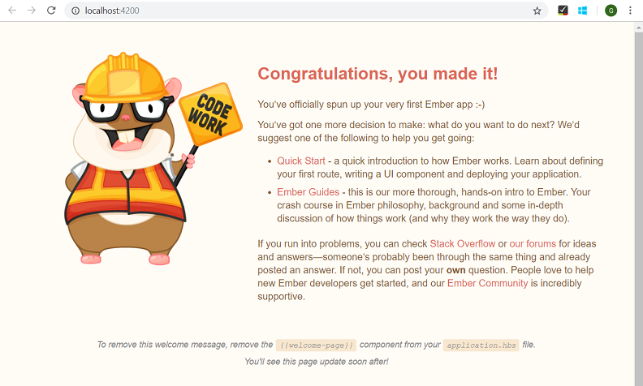

---
Order:
Area: nodejs
TOCTitle: Ember Tutorial
ContentId: 4a60ed36-93ff-4ff3-b650-ce74baa405ca
PageTitle: Ember JavaScript Tutorial in Visual Studio Code
DateApproved:
MetaDescription: Ember JavaScript tutorial showing IntelliSense, debugging, and code navigation support in the Visual Studio Code editor.
---
# Using Ember in Visual Studio Code

[Ember.js](https://emberjs.com/) is a popular JavaScript framework for building web application user interfaces. The Visual Studio Code editor supports Ember IntelliSense and code navigation out of the box.



## Welcome to Ember

We'll be using the [Ember CLI](https://ember-cli.com/) for this tutorial. To install and use the command line interface as well as run the Ember.js application server, you'll need the [Node.js](https://nodejs.org/) JavaScript runtime and [npm](https://www.npmjs.com/) (the Node.js package manager) installed. npm is included with Node.js which you can install from [here](https://nodejs.org/en/download/).

>**Tip**: To test that you have Node.js and npm correctly installed on your machine, you can type `node --version` and `npm --version`.

To install Ember CLI, in a terminal or command prompt type:

```bash
npm install -g ember-cli
```

This may take a few minutes to install. You can now create a new Ember.js application by typing:

```bash
ember new my-app
```

`my-app` is the name of the folder for your application. This may take a few minutes to create the Ember application in [JavaScript](/docs/languages/javascript.md) and install its dependencies.

Let's quickly run our Ember application by navigating to the new folder and typing `ember serve` to start the web server and open the application in a browser:

```bash
cd my-app
ember serve
```

You should see "Congratulations, you made it!" on `http://localhost:4200` in your browser. We'll leave the web server running while we look at the application with VS Code.

To open your Ember application in VS Code, open another terminal (or command prompt) and navigate to the `my-app` folder and type `code .`:

```bash
cd my-app
code .
```
