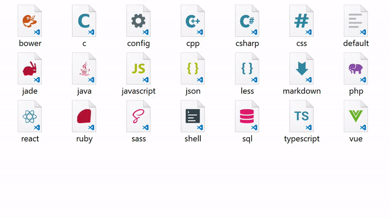
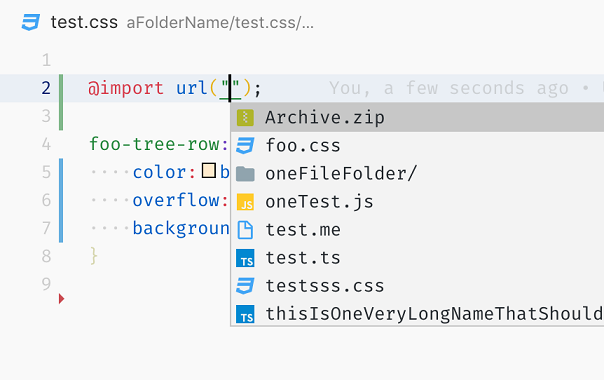
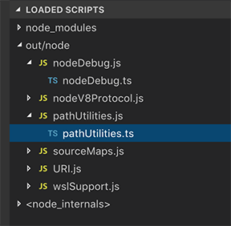
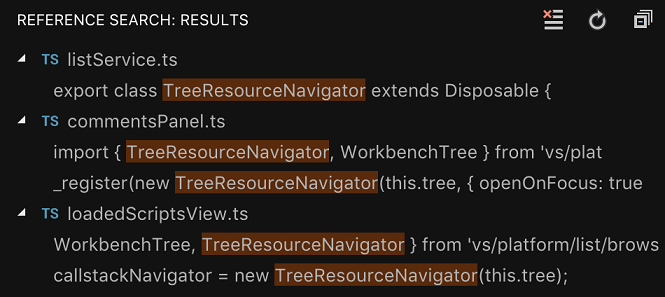

# October 2018 (version 1.29)

<!-- DOWNLOAD_LINKS_PLACEHOLDER -->

## Insiders Release

Welcome to the Insiders build. These are the preliminary notes for the October 1.29 release of Visual Studio Code. As we get closer to the release date, you'll see details below about new features and important fixes.

Until the October release notes are available, you can still track our progress:

* **[October Iteration Plan](https://github.com/Microsoft/vscode/issues/60106)** - See what's planned for the milestone.
* **[Commit Log](https://github.com/Microsoft/vscode/commits/master)** - GitHub commits to the vscode open source repository.
* **[Closed issues](https://github.com/Microsoft/vscode/milestone/78?closed=1)** - Resolved bugs and implemented feature requests in the October milestone.

We really appreciate people taking a look at our new features as soon as they are ready so check back here often and learn what's new to try out.

If you find issues or have suggestions, you can enter them in the VS Code repository on [GitHub](https://github.com/Microsoft/vscode/issues).

## Workbench

### Multiline search

VS Code now supports multiline search! Same as in the editor, a regex search executes in multiline mode only if it contains a `\n` literal. The Search view shows a hint next to each multiline match, with the number of additional match lines.


This feature is possible thanks to the work done in the [ripgrep](https://github.com/BurntSushi/ripgrep) tool to implement multiline search.

### Backreferences and lookahead in search

It is also now possible to use backreferences and lookahead assertions in regex searches, by setting `"search.usePCRE2": true`. This configures [ripgrep](https://github.com/BurntSushi/ripgrep) to use the PCRE2 regex engine. While PCRE2 supports many other features, we only support regex expressions that are still valid in JavaScript, because open editors are still searched using the editor's JavaScript-based search.


If you are still missing lookbehind assertions, don't worry! That feature is just recently supported by JavaScript and should come to VS Code in a later Electron shell update.

### Highlight modified tabs

A new setting `workbench.editor.highlightModifiedTabs` displays a thick border at the top of editor tabs whenever the editor is dirty (has unsaved changes). This makes it easier to find files that need to be saved. The color of the border can be customized (see below).


### Symbol order in breadcrumbs

There is a new setting that controls how symbols in the breadcrumbs picker are ordered: `breadcrumbs.symbolSortOrder`. Allowed values are `position` (default), `name`, and `type`.


### Breadcrumbs and preview editors

When middle clicking items in the breadcrumbs navigation, they now open in a new editor, just like it does when middle clicking files in the Explorer.

### macOS Mojave: Dark mode support

The macOS Mojave dark mode is now better supported in VS Code. Previously, VS Code menus and dialogs would show with the default light theme, even if macOS was running in dark theme. Now, all native UI elements will show with the dark mode if enabled.


### macOS: Simple full screen support

A new setting `window.nativeFullScreen` was introduced that, if set to `false`, will enable full screen mode for VS Code that does not use the native macOS full screen feature. This has the advantage that entering full screen mode will not create a macOS space on the desktop. By default, VS Code will still use macOS native full screen.

### Windows: Removed smoothScrollingWorkaround setting

The `window.smoothScrollingWorkaround` setting was removed and is no longer supported. It was introduced as a workaround for an issue where scrolling with the mouse became laggy once the VS Code window was minimized and restored (see issue [13612](https://github.com/Microsoft/vscode/issues/13612)). This issue was resolved with the Windows 10 Redstone 5 update. If you see this issue, please update Windows 10 to the latest version.

### Notifications automatically hide even when showing buttons

Previously, VS Code would never hide notifications if they included buttons. This resulted in the potential for notifications to pile up in the lower right corner and cover parts of the editor. With this release, notifications are hidden after a timeout even if they show buttons.

There are two exceptions:

* Notifications with `error` severity will not be hidden on the assumption that the user needs to take some action.
* A few specific notifications from VS Code will remain open. For example, the notification that asks whether you want to opt-out of sending telemetry.

**Note:** Even if notifications are hidden, you can always access all notifications from the Notification Center, either by clicking on the little bell icon in the Status bar or via the **Show Notifications** (`notifications.toggleList`) command.

### Centered editor layout auto resize

Centered layout view will now automatically resize to max width when more than 1 editor group is open. This should make centered layout easier to use and require less manual toggling. This behavior is controlled by a new setting `workbench.editor.centeredLayoutAutoResize` which is enable by default.

### Moved panel toggle location button from title bar to context menu
TODO@isidor

### New default for `files.eol`: `auto`

The `files.eol` end of line setting now has a new default value `auto`. When set, the end of line character for new files is specific to the operating system. It is `\r\n` on Windows and `\n` on macOS and Linux. You can also still explicitly set `file.eol` to `\n` or `\r\n`.

### Updated file icons per file type

In the [previous release](https://code.visualstudio.com/updates/v1_28#_file-icons-per-file-type), we added custom icons for common VS Code file types. We now added those icons to smaller views so they will appear in a list view.



### Use global .gitignore file in search

Git allows you to configure a global `gitignore` file using the `core.excludesfile` config property. By default, search does not look at the global `gitignore` file, but you can now change this by enabling the new setting `search.useGlobalIgnoreFiles`.

### Allow replace preview in search to be disabled

There is a new setting `search.useReplacePreview` which allows you to disable the preview diff that appears when doing a search/replace in the Search view.

### "Modified in" in settings editor is navigable

In the settings editor, we show a hint when a setting is configured in a scope (User, Workspace) other than the currently selected scope. The other scope hint is now a link that will take you to the setting in the other scope.


### Show line numbers in search

We've added a setting `search.showLineNumbers` which will display the line number for each match in the search view.


## Editor

### File and folder icons in IntelliSense

The IntelliSense widget now shows file and folder icons for file completions based on your File Icon theme. This provides a unified look and helps you quickly identify different file types.



### Format Selection

To speed up small formatting operations, the **Format Selection** command without a selection will now format the current line.

### Show error codes

The editor now shows the error code of a problem if an error code is available.

In the TSLint error below, the error code is the string 'semicolon'.


## Integrated Terminal

### Split terminal can inherit working directory

A new setting `terminal.integrated.splitCwd` was added that allows configuring what current working directory (cwd) a terminal gets when a terminal is split:

* `workspaceRoot`: The previous behavior; a new split terminal will use the workspace root as the working directory. In a multi-root workspace, a choice for which root folder to use is offered.
* `initial`: A new split terminal will use the working directory that the parent terminal started with.
* `inherited`: On macOS and Linux, a new split terminal will use the working directory of the parent terminal. On Windows, this behaves the same as `initial`.

### Experimental buffer improvements

A new setting `terminal.integrated.experimentalBufferLineImpl` allows changing how the terminal stores its buffer to a `TypedArray`/`ArrayBuffer`-based implementation. If you would like to opt-in, you can expect performance improvements across the board including reduced memory usage and garbage collection, and an overall increase to the throughput of the terminal.

```json
{
  "terminal.integrated.experimentalBufferImpl": "TypedArray"
}
```

This is just the beginning, we're expecting further improvements to throughput and memory usage over the next couple of releases before making this the default implementation. A special thanks to [@jerch](https://github.com/jerch) from the [xterm.js](https://github.com/xtermjs/xterm.js) team, who has been the main driving force behind this [multi-month project](https://github.com/xtermjs/xterm.js/issues/791).

### Cmd+Backspace to delete to the start of the line

A new keybinding was added on macOS for `Cmd+Backspace` which sends `\u0015` (Ctrl+U) to the terminal. In bash, this deletes from the cursor to the start of the line, in zsh, it deletes the whole line.

## Tasks

### Clear terminal before executing task

A new property `clear` was added to the task `presentation` configuration. Set the `clear` property to `true` to clear the terminal before the task is run.

## Debugging

### Collapsable stack frames
TODO@Isidor

### Improved Loaded Scripts view

In this milestone, we updated the **Loaded Scripts** view to support file icons and added the capability to show **related resources** as child elements. Debug extensions can use this feature to show the source file(s) that were transpiled into a script.

The following picture from the Node.js debugger shows the TypeScript source for JavaScripts files (as available in source maps):



Please note that the related resources feature requires opt-in by debug extensions. In the October release, only `node-debug` has experimental support for this feature for Node.js versions < 8.0 (aka "legacy").

### Multiple debug consoles
TODO@Isidor

### Breakpoint widget expands to multiple lines
TODO@Isidor

###  Start debugging with stop on entry
TODO@Isidor

### Node debugging supports console.log styling
TODO@Rob

## Engineering

### Continued Electron 3.0 exploration

During this milestone, we continued to explore bundling Electron 3.0.0 into VS Code. This is a major Electron release and comes with Chrome 66 and Node.js 10.x (a major leap forward compared to our current version that has Chrome 61 and Node.js 8.x). We plan to push out the update to our Insiders users in the near future to gather additional feedback. If you are interested in helping out, make sure to install VS Code [Insiders](https://code.visualstudio.com/insiders).

## Miscellaneous

### Workspace storage back end changed to SQLite

In preparation of the upcoming Electron 3.0 update, we are moving our storage solution away from `window.localStorage` to our own solution with a SQLite back end (more information in issue [58957](https://github.com/Microsoft/vscode/issues/58957)). You should not notice any difference and existing data is migrated. In this milestone, only workspace storage is affected, while in the next milestone, we will also move global storage out. Once this transition is done, we will be able to push the Electron 3.0 update to our Insiders channel.

### Electron update

In this release, we updated from Electron 2.0.9 to 2.0.12.

## Extension Authoring

### Active terminal APIs

The proposed APIs that give access to the active terminal, `window.activeTerminal` and `window.onDidChangeActiveTerminal`, are now stable.

### Notifications with buttons hide after a timeout

If your extension is using the `showInformationMessage` or `showWarningMessage` API with the non-modal option and buttons, note that these notifications will now hide after a certain timeout. Only notifications triggered via `showErrorMessage` and having buttons will stay open as before. If you must get immediate input from the user or need to show a message prominently, you can still use `modal: true` as option. This will bring up a modal dialog that blocks the user from doing anything until dismissed. We do however discourage overuse of this option because it interrupts the user.

### Extension globalState updates across windows

If you are using `context.globalState` to store data globally, we now send changes to this data to all other windows (instances) that might be opened running your extension. There is currently no event when this happens, but the data will always be in sync with the latest change that was made.

### Custom views: Expand revealed elements

You can now expand an element to reveal using the `expand` option in the `reveal` API. It also supports recursively expanding child elements by passing the number of levels.

**NOTE:** You can only recursively expand to a maximum of 3 levels.

```typescript
/**
 * Reveals the given element in the tree view.
 * If the tree view is not visible then the tree view is shown and element is revealed.
 *
 * By default revealed element is selected.
 * In order to not to select, set the option `select` to `false`.
 * In order to focus, set the option `focus` to `true`.
 * In order to expand the revealed element, set the option `expand` to `true`. To expand recursively set `expand` to the number of levels to expand.
 * **NOTE:** You can expand only to 3 levels maximum.
 *
 * **NOTE:** [TreeDataProvider](#TreeDataProvider) is required to implement [getParent](#TreeDataProvider.getParent) method to access this API.
 */
reveal(element: T, options?: { select?: boolean, focus?: boolean, expand?: boolean | number }): Thenable<void>;
```

### New theme colors

There are new theme colors:

* `tab.activeModifiedBorder`: Border on the top of modified (dirty) active tabs in an active group.
* `tab.inactiveModifiedBorder`: Border on the top of modified (dirty) inactive tabs in an active group.
* `tab.unfocusedActiveModifiedBorder`: Border on the top of modified (dirty) active tabs in an unfocused group.
* `tab.unfocusedInactiveModifiedBorder`: Border on the top of modified (dirty) inactive tabs in an unfocused group.
* `editor.stackFrameHighlightBackground`: Background color of the top debug stack frame highlight in the editor. By default this color is yellow.
* `editor.focusedStackFrameHighlightBackground`: Background color of the focused debug stack frame highlight in the editor. By default this color is green.

## Proposed Extension APIs

Every milestone comes with new proposed APIs and extension authors can try them out. As always we are keen on your feedback. This is what you have to do to try out a proposed API:

* You must use Insiders because proposed APIs change frequently.
* You must have this line in the `package.json` file of your extension: `"enableProposedApi": true`.
* Copy the latest version of the [`vscode.proposed.d.ts`](https://github.com/Microsoft/vscode/blob/master/src/vs/vscode.proposed.d.ts) file into your project.

Note that you cannot publish an extension that uses a proposed API. We may likely make breaking changes in the next release and we never want to break existing extensions.

### Clipboard API

We have a proposed API to access the clipboard. It follows the up-coming browser [Clipboard](https://developer.mozilla.org/en-US/docs/Web/API/Clipboard) API and currently allows reading and writing of text:

```ts
export interface Clipboard {
  readText(): Thenable<string>;
  writeText(value: string): Thenable<void>;
}
export namespace env {
  const const clipboard: Clipboard;
}
```

### Completion text insert rules

There is a new proposed API to modify the insert behavior of completion items. By default, multiline completions get 're-formatted' to match in the indentation of the current line. Sometimes this indentation is unwanted and the new proposed API allows a completion to turn it off. `CompletionItemInsertTextRule` is a bitmask that has a `KeepWhitespace` rule that a completion can set.

### Custom views

**Collapse All action**

You can add **Collapse All** action to your view by just setting `showCollapseAll` option to `true` while creating the `TreeView`.

```typescript
/**
 * Options for creating a [TreeView](#TreeView]
 */
export interface TreeViewOptions<T> {

    /**
     * A data provider that provides tree data.
     */
    treeDataProvider: TreeDataProvider<T>;

    /**
     * Whether to show collapse all action or not.
     */
    showCollapseAll?: boolean;
}

namespace window {

    export function createTreeView<T>(viewId: string, options: TreeViewOptions<T>): TreeView<T>;

}
```

VS Code provides the **Collapse All** functionality and shows it with same icon and location for all opted-in views.


**TreeItem label highlights**

You can highlight the `TreeItem` label by providing ranges using the `highlights` option. Since it is a proposed API, you have to use `TreeItem2` to update highlights.

```typescript
/**
 * Label describing the [Tree item](#TreeItem)
 */
export interface TreeItemLabel {

    /**
     * A human-readable string describing the [Tree item](#TreeItem).
     */
    label: string;

    /**
     * Ranges in the label to highlight. A range is defined as a tuple of two number where the
     * first is the inclusive start index and the second the exclusive end index
     */
    highlights?: [number, number][];

}

export class TreeItem2 extends TreeItem {
    /**
     * Label describing this item. When `falsy`, it is derived from [resourceUri](#TreeItem.resourceUri).
     */
    label?: string | TreeItemLabel | /* for compilation */ any;

    /**
     * @param label Label describing this item
     * @param collapsibleState [TreeItemCollapsibleState](#TreeItemCollapsibleState) of the tree item. Default is [TreeItemCollapsibleState.None](#TreeItemCollapsibleState.None)
     */
    constructor(label: TreeItemLabel, collapsibleState?: TreeItemCollapsibleState);
}
```



## Notable Fixes

* [59305](https://github.com/Microsoft/vscode/issues/59305): Show a "Open Workspace" button in .code-workspace files
* [54214](https://github.com/Microsoft/vscode/issues/54214): startDebugging method in vscode still return true even when the build fails
* [62085](https://github.com/Microsoft/vscode/issues/62085): PauseRequest not being received by the debugAdapter
* [57321](https://github.com/Microsoft/vscode/issues/57321): Show "Clear Search" and "Clear Filters" buttons when settings search returns no results
* [57289](https://github.com/Microsoft/vscode/issues/57289): Settings UI should remember its search on reload

## Thank You

Last but certainly not least, a big *__Thank You!__* to the following folks that helped to make VS Code even better:

Contributions to `vscode`:

Contributions to `vscode-eslint`:

* [Loune Lam (@loune)](https://github.com/loune): Added Suppress rule for this line / Suppress rule for file quick actions / Show documentation [PR #530](https://github.com/Microsoft/vscode-eslint/pull/530)
* [Nguyen Long Nhat (@torn4dom4n)](https://github.com/torn4dom4n): Update Variables Reference [#553](https://github.com/Microsoft/vscode-eslint/pull/553)
* [David Broder-Rodgers (@broder)](https://github.com/broder): Fix some typos in eslintServer [PR #555](https://github.com/Microsoft/vscode-eslint/pull/555)

Contributions to `vscode-languageserver-node`:

* [Vic Nightfall (@Victorious3)](https://github.com/Victorious3): Spelling error in exception [PR #419](https://github.com/Microsoft/vscode-languageserver-node/pull/419)
* [Chris Wendt (@chrismwendt)](https://github.com/chrismwendt): Fix examples in the README [PR #428](https://github.com/Microsoft/vscode-languageserver-node/pull/428)
* [Thibaud Colas (@thibaudcolas)](https://github.com/thibaudcolas): Update version in lockfile to match package.json [PR #431](https://github.com/Microsoft/vscode-languageserver-node/pull/431)

Contributions to `language-server-protocol`:

* [Tobias Bieniek (@Turbo87)](https://github.com/Turbo87): overview: Fix example response id [PR #575](https://github.com/Microsoft/language-server-protocol/pull/575)
* [Jonathan Yee (@jonyeezs)](https://github.com/jonyeezs): Readme: Use comma to make list more readable [PR #578](https://github.com/Microsoft/language-server-protocol/pull/578)
* [Lewis Cowper (@lewiscowper)](https://github.com/lewiscowper): Fixes #461 - Turn headers into hyperlinks (website) [PR #577](https://github.com/Microsoft/language-server-protocol/pull/577)
* [Remy Suen (@rcjsuen)](https://github.com/rcjsuen): Correct typo in request name [PR #589](https://github.com/Microsoft/language-server-protocol/pull/589)
* [@fghzxm](https://github.com/fghzxm): Fix broken parentheses [PR #590](https://github.com/Microsoft/language-server-protocol/pull/590)

Contributions to `vscode-css-languageservice`:

* [Will Bender (@Ragnoroct)](https://github.com/Ragnoroct): Show specificity in a CSS selector hover. [PR #129](https://github.com/Microsoft/vscode-css-languageservice/pull/129)
* [Richard Samuelson (@ricsam)](https://github.com/ricsam): Remove package-lock.json [PR #125](https://github.com/Microsoft/vscode-css-languageservice/pull/125)

Contributions to `vscode-html-languageservice`:

* [@AHKol](https://github.com/AHKol): Fix 58693 [PR #38](https://github.com/Microsoft/vscode-html-languageservice/pull/38)

Contributions to `vscode-json-languageservice`:

* [Debasish Sahoo (@debck)](https://github.com/debck): add license badge to readme [PR #31](https://github.com/Microsoft/vscode-json-languageservice/pull/31)
* [Flo Edelmann (@FloEdelmann)](https://github.com/FloEdelmann): Don't wrap in array and object completions [PR #29](https://github.com/Microsoft/vscode-json-languageservice/pull/29)
* [Levertion (@Levertion)](https://github.com/Levertion): Use 'if' to create completions [PR #27](https://github.com/Microsoft/vscode-json-languageservice/pull/27)
* [Literallie (@xxyy)](https://github.com/xxyy)
  * Resolve test failure caused by changed error message [PR #33](https://github.com/Microsoft/vscode-json-languageservice/pull/33)
  * More concise error message for schema validation errors [PR #32](https://github.com/Microsoft/vscode-json-languageservice/pull/32)

Contributions to `debug-adapter-protocol`:

* [Igor Kulaychuk (@ayuckhulk)](https://github.com/ayuckhulk): Add NetCoreDbg to Debug Adapter Protocol implementors list [PR #9](https://github.com/Microsoft/debug-adapter-protocol/pull/9)
* [Mario Loriedo (@l0rd)](https://github.com/l0rd): Add Theia among the Dev Tools [PR #10](https://github.com/Microsoft/debug-adapter-protocol/pull/10)
* [Sven Efftinge (@svenefftinge)](https://github.com/svenefftinge): Theia is maintained by Eclipse community [PR #11](https://github.com/Microsoft/debug-adapter-protocol/pull/11)

Contributions to `vscode-debugadapter-node`:

* [Shennie Yao (@Shenniey)](https://github.com/Shenniey)
  * Changing to UTC [PR #203](https://github.com/Microsoft/vscode-debugadapter-node/pull/203)
  * adding timestamp logging to be configurable (turned on by default) [PR #202](https://github.com/Microsoft/vscode-debugadapter-node/pull/202)

Contributions to `vscode-chrome-debug-core`:

* [@digeff](https://github.com/digeff)
  * We adapt to the latest version of Node.js which uses file:/// and we don't send sourceRef for files that exist [PR #373](https://github.com/Microsoft/vscode-chrome-debug-core/pull/373)
  * Fix not hitting BPs on the first line of NTVS unit tests [PR #369](https://github.com/Microsoft/vscode-chrome-debug-core/pull/369)
  * Fix node not hitting breakpoints in network paths [PR #368](https://github.com/Microsoft/vscode-chrome-debug-core/pull/368)
* [@rdegelo](https://github.com/rdegelo)
  * Improving Debug Console Styling. Adding underline and background support [PR #374](https://github.com/Microsoft/vscode-chrome-debug-core/pull/374)
  * Added support for basic color escape sequencies on Debug Console [PR #367](https://github.com/Microsoft/vscode-chrome-debug-core/pull/367)

<!-- In-product release notes styles.  Do not modify without also modifying regex in gulpfile.common.js -->
<a id="scroll-to-top" role="button" aria-label="scroll to top" href="#"><span class="icon"></span></a>
<link rel="stylesheet" type="text/css" href="css/inproduct_releasenotes.css"/>
