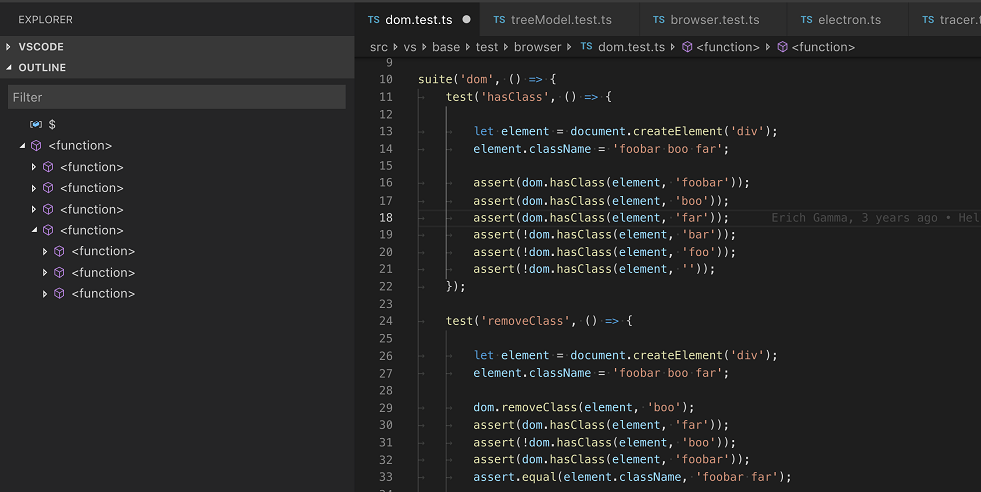
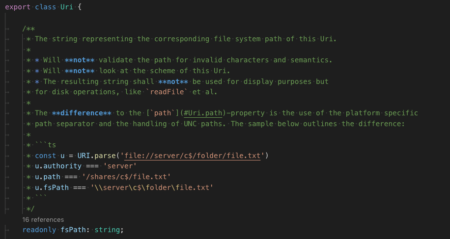

# November 2018 (version 1.30)

<!-- DOWNLOAD_LINKS_PLACEHOLDER -->

## Insiders Release

Welcome to the Insiders build. These are the preliminary notes for the November 1.30 release of Visual Studio Code. As we get closer to the release date, you'll see details below about new features and important fixes.

Until the November release notes are available, you can still track our progress:

* **[November Iteration Plan](https://github.com/Microsoft/vscode/issues/62876)** - See what's planned for the milestone.
* **[Commit Log](https://github.com/Microsoft/vscode/commits/master)** - GitHub commits to the vscode open source repository.
* **[Closed issues](https://github.com/Microsoft/vscode/milestone/81?closed=1)** - Resolved bugs and implemented feature requests in the November milestone.

We really appreciate people taking a look at our new features as soon as they are ready so check back here often and learn what's new to try out.

If you find issues or have suggestions, you can enter them in the VS Code repository on [GitHub](https://github.com/Microsoft/vscode/issues).

## Extensions

You can now go back to previous version of an extension if its current version is having issues.. VS Code provides an action on an installed extension to install another version of it.


## Languages

### TypeScript 3.2

<!-- TODO mjbvz -->

### File icons for JavaScript and TypeScript path suggestions

We now show the proper file icons for path suggestions

### Renames now handle JS/TS object shorthand properly

<!-- TODO mjbvz -->

### Improved display of JavaScript and TypeScript callbacks in navigation

JavaScript and TypeScript anonymous callbacks were all previously labeled as `<function>` in the Outline view, breadcrumbs view, and document symbol list. This made it impossible to tell which function you were really after:



With TypeScript 3.2+, VS Code now displays more context for callback functions so that you can tell them apart:


### Highlighting of Markdown elements in JSDoc comments

Fenced code blocks and other Markdown elements inside of JSDoc blocks are now syntax highlighted:



This inline highlighting better matches VS Code's Markdown rendering of JSDocs for hovers and IntelliSense documentation.

## Preview Features

Preview features are not ready for release but are functional enough to use. We welcome your early feedback while they are under development.

### HTML custom tags / attributes support

The new `html.experimental.custom.tags` and `html.experimental.custom.attributes` settings allows you to specify a list of tags and attributes that VS Code loads during startup. When you are editing HTML files, VS Code will offer auto-completion and hover for those tags and attributes. This works great with [Web Components](https://developer.mozilla.org/en-US/docs/Web/Web_Components), for example:


You can open [octref/web-components-examples](https://github.com/octref/web-components-examples) repository to test this feature. This feature is **in preview and both the setting names and JSON format are subject to change**.

If you have feedback or feature requests, please follow up in issue [#62976](https://github.com/Microsoft/vscode/issues/62976).

## Extension Authoring

### Configuring contributed TypeScript server plugins

Extensions can now send configuration data to [contributed typescript server plugins](https://code.visualstudio.com/docs/extensionAPI/extension-points#_contributestypescriptserverplugins) through an API provided by VS Code's built-in TypeScript extension:

```typescript
// In your VS Code extension

export async function activate(context: vscode.ExtensionContext) {
    // Get the TS extension
    const tsExtension = vscode.extensions.gettsExtension('vscode.typescript-language-features');
    if (!tsExtension) {
        return;
    }

    await tsExtension.activate();

    // Get the API from the TS extension
    if (!tsExtension.exports || !tsExtension.exports.getAPI) {
        return;
    }

    const api = tsExtension.exports.getAPI(0);
    if (!api) {
        return;
    }

    // Configure the 'my-typescript-plugin-id' plugin
    api.configurePlugin('my-typescript-plugin-id', {
        someValue: process.env['SOME_VALUE']
    });
}
```

The TypeScript server plugin receives the configuration data through an `onConfigurationChanged` method:

```typescript
// In your TypeScript plugin

import * as ts_module from 'typescript/lib/tsserverlibrary';

export = function init({ typescript }: { typescript: typeof ts_module }) {
    return {
        create(info: ts.server.PluginCreateInfo) {
            // Create new language service
        },
        onConfigurationChanged(config: any) {
            // Receive configuration changes sent from VS Code
        },
    };
};
```

This API allows VS Code extensions to synchronize VS Code settings with a TypeScript server plugin, or dynamically change the behavior of a plugin. Take a look at the [TypeScript TSLint plugin](https://github.com/Microsoft/vscode-typescript-tslint-plugin/blob/master/src/index.ts) and [lit-html](https://github.com/mjbvz/vscode-lit-html/blob/master/src/index.ts) extensions to see how this API is used in practice.

## Engineering

### Continued Electron 3.0 exploration

During this milestone, we continued to explore bundling Electron 3.0.0 into VS Code. This is a major Electron release and comes with Chrome 66 and Node.js 10.x (a major leap forward compared to our current version that has Chrome 61 and Node.js 8.x). We plan to push out the update to our Insiders users in December to gather additional feedback. If you are interested in helping out, make sure to install VS Code [Insiders](https://code.visualstudio.com/insiders).

## Thank You

Last but certainly not least, a big *__Thank You!__* to the following folks that helped to make VS Code even better:

Contributions to `vscode-eslint`:

* [AnguloHerrera (@angulito)](https://github.com/angulito): Improve pipeline [PR #569](https://github.com/Microsoft/vscode-eslint/pull/569)

Contributions to `language-server-protocol`:

* [Jan Keromnes (@jankeromnes)](https://github.com/jankeromnes): Minor improvements: Typos, grammar, wording. [PR #579](https://github.com/Microsoft/language-server-protocol/pull/579)
* [Adolfo Ochagavía (@aochagavia)](https://github.com/aochagavia): Fix typo in specification [PR #597](https://github.com/Microsoft/language-server-protocol/pull/597)

Contributions to `vscode-languageserver-node`:

* [Guillaume Martres (@smarter)](https://github.com/smarter): Add asVersionedTextDocumentIdentifier to the Converter interface [PR #421](https://github.com/Microsoft/vscode-languageserver-node/pull/421)

<!-- In-product release notes styles.  Do not modify without also modifying regex in gulpfile.common.js -->
<a id="scroll-to-top" role="button" aria-label="scroll to top" href="#"><span class="icon"></span></a>
<link rel="stylesheet" type="text/css" href="css/inproduct_releasenotes.css"/>
