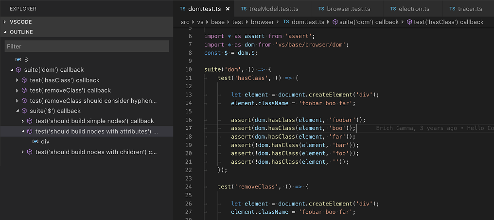

# November 2018 (version 1.30)

<!-- DOWNLOAD_LINKS_PLACEHOLDER -->

## Insiders Release

Welcome to the Insiders build. These are the preliminary notes for the November 1.30 release of Visual Studio Code. As we get closer to the release date, you'll see details below about new features and important fixes.

Until the November release notes are available, you can still track our progress:

* **[November Iteration Plan](https://github.com/Microsoft/vscode/issues/62876)** - See what's planned for the milestone.
* **[Commit Log](https://github.com/Microsoft/vscode/commits/master)** - GitHub commits to the vscode open source repository.
* **[Closed issues](https://github.com/Microsoft/vscode/milestone/81?closed=1)** - Resolved bugs and implemented feature requests in the November milestone.

We really appreciate people taking a look at our new features as soon as they are ready so check back here often and learn what's new to try out.

If you find issues or have suggestions, you can enter them in the VS Code repository on [GitHub](https://github.com/Microsoft/vscode/issues).

## Languages

### TypeScript 3.2

<!-- TODO mjbvz -->

### File icons for JavaScript and TypeScript path suggestions

<!-- TODO mjbvz -->

### Rename now handles JS/TS object shorthand properly

<!-- TODO mjbvz -->

### Improved display of JavaScript and TypeScript callbacks in navigation

JavaScript and TypeScript anonymous callbacks were all previously labeled as `<function>` the outline view, breakcrumbs view, and document symbol list. This made it impossible to tell which function you were really after:

With TypeScript 3.2+, VS Code now displays more context for callback function so that you can tell them apart:

### Highlighting of markdown elements in JS Doc comments

<!-- TODO mjbvz -->

### DTS gen

<!-- TODO mjbvz -->

##  Extension Authoring

### Configuring contributed TypeScript server plugins

<!-- TODO mjbvz -->

## Thank You

Last but certainly not least, a big *__Thank You!__* to the following folks that helped to make VS Code even better:

Contributions to `vscode-eslint`:

* [AnguloHerrera (@angulito)](https://github.com/angulito): Improve pipeline [PR #569](https://github.com/Microsoft/vscode-eslint/pull/569)

Contributions to `language-server-protocol`:

* [Jan Keromnes (@jankeromnes)](https://github.com/jankeromnes): Minor improvements: Typos, grammar, wording. [PR #579](https://github.com/Microsoft/language-server-protocol/pull/579)
* [Adolfo Ochagavía (@aochagavia)](https://github.com/aochagavia): Fix typo in specification [PR #597](https://github.com/Microsoft/language-server-protocol/pull/597)

Contributions to `vscode-languageserver-node`:

* [Guillaume Martres (@smarter)](https://github.com/smarter): Add asVersionedTextDocumentIdentifier to the Converter interface [PR #421](https://github.com/Microsoft/vscode-languageserver-node/pull/421)

<!-- In-product release notes styles.  Do not modify without also modifying regex in gulpfile.common.js -->
<a id="scroll-to-top" role="button" aria-label="scroll to top" href="#"></a>
<link rel="stylesheet" type="text/css" href="css/inproduct_releasenotes.css"/>
